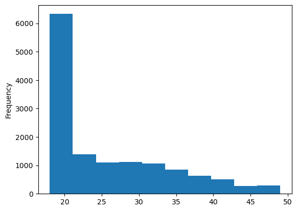
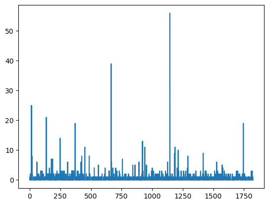

# Homework 1

### A brief description of my previous experience with Data Science.
Based on my current understanding of data science, I consider myself a complete beginner. The only course I've taken that I believe is related to data science is 'Linjära statistiska modeller.' Additionally, I've completed the course 'Programmeringsteknit för matematiker,' where I gained basic knowledge of Python. 

### Then I will be reading two CSV files: the first one located on the web, and the other one downloaded and saved on my computer. 
Here are the details:


```python
#import two packages for reading and ploting CSV files.
import pandas as pd
import matplotlib.pyplot as plt 

# Webpage URL
url = "https://raw.githubusercontent.com/mskoldSU/MT5003_HT17/master/Projekt/proj_data.csv"
data_individ = pd.read_csv(url)
data_individ.head()

data_individ["Alder"].plot.hist()
plt.show()
```


    

    


```python
# download a csv file from web: https://www.stats.govt.nz/large-datasets/csv-files-for-download/ and save it in my computer, then read it 
data = pd.read_csv(r"C:\Users\catri\OneDrive\文档\LIWU\HW1\table13.csv")
print(data.head().to_markdown(index=False))
```

    | State   | Agency type   | Agency name   |   Race |   Religion |   Sexual orientation |   Ethnicity |   Disability |   Gender |   Gender Identity |   1st quarter |   2nd quarter |   3rd quarter |   4th quarter | Population   |
    |:--------|:--------------|:--------------|-------:|-----------:|---------------------:|------------:|-------------:|---------:|------------------:|--------------:|--------------:|--------------:|--------------:|:-------------|
    | Alabama | Cities        | Florence      |      2 |          0 |                    0 |           0 |            0 |        0 |                 0 |             0 |             1 |             0 |             1 | 39,481       |
    | Alabama | Cities        | Hoover        |      0 |          0 |                    1 |           0 |            0 |        0 |                 0 |             0 |             1 |             0 |             0 | 84,139       |
    | Alabama | Cities        | Prattville    |      2 |          0 |                    0 |           0 |            0 |        0 |                 0 |             1 |             0 |             1 |             0 | 35,154       |
    | Alabama | Cities        | Tuscaloosa    |      1 |          0 |                    0 |           0 |            0 |        0 |                 0 |             0 |             0 |             1 |             0 | 94,126       |
    | Alaska  | Cities        | Anchorage     |      8 |          0 |                    0 |           0 |            0 |        0 |                 0 |             2 |             3 |             3 |             0 | 299,455      |
    


```python
data["1st quarter"].plot()
plt.show()
```


    

    


```python

```
