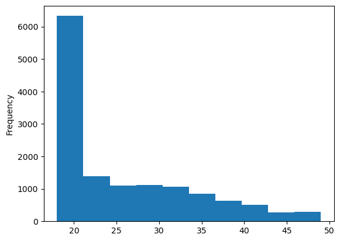
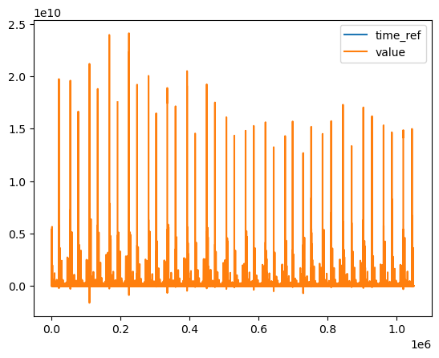

```python
#import two packages for reading and ploting CSV files.
import pandas as pd
import matplotlib.pyplot as plt 

# Webpage URL
url = "https://raw.githubusercontent.com/mskoldSU/MT5003_HT17/master/Projekt/proj_data.csv"
data_individ = pd.read_csv(url)
data_individ.head()

data_individ["Alder"].plot.hist()
plt.show()
```


    

    


```python
# download a csv file from web: https://www.stats.govt.nz/large-datasets/csv-files-for-download/ and save it in my computer, then read it 
business_data = pd.read_csv(r"C:\Users\catri\OneDrive\文档\LIWU\HW1\international-trade-june-2023-quarter\output_csv_full.csv")
business_data.head()

business_data.plot()
plt.show()
```


    

    


```python

```
