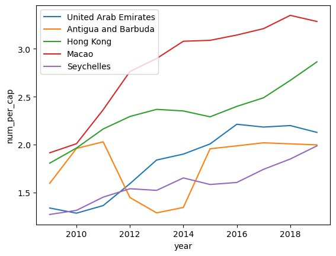

```python
import pandas as pd
import matplotlib.pyplot as plt 
import seaborn as sns
```

# Cleaning data

Before cleaning the data, it is essential to check the unique values in each column because our interest lies in the number of cell phones per capita across different years and countries. Examining the code below reveals that, from the year 1960 to 1979, the number of cell phones is either null or zero. Therefore, we can safely delete these columns directly, resulting in fewer columns to process.

Next, we address the remaining zero and null values in the data. We convert them to numeric values and use the forward-fill method to handle the null values.

With these steps, we obtain the cleaned data for the first table.


```python
# read the number of cellphones data
URL = "https://raw.githubusercontent.com/mt4007-ht23/data/main/cell_phones_total.csv"
data = pd.read_csv(URL)

#check the unique values of each column
unique_values_per_column = data.apply(lambda x: x.unique())
print(unique_values_per_column.to_markdown())
```

    |       | 0                                                                          |
    |:------|:---------------------------------------------------------------------------|
    | iso-3 | ['ABW' 'AFG' 'AGO' 'ALB' 'AND' 'ARE' 'ARG' 'ARM' 'ASM' 'ATG' 'AUS' 'AUT'   |
    |       |  'AZE' 'BDI' 'BEL' 'BEN' 'BFA' 'BGD' 'BGR' 'BHR' 'BHS' 'BIH' 'BLR' 'BLZ'   |
    |       |  'BMU' 'BOL' 'BRA' 'BRB' 'BRN' 'BTN' 'BWA' 'CAF' 'CAN' 'CHE' 'CHL' 'CHN'   |
    |       |  'CIV' 'CMR' 'COD' 'COG' 'COL' 'COM' 'CPV' 'CRI' 'CUB' 'CUW' 'CYM' 'CYP'   |
    |       |  'CZE' 'DEU' 'DJI' 'DMA' 'DNK' 'DOM' 'DZA' 'ECU' 'EGY' 'ERI' 'ESP' 'EST'   |
    |       |  'ETH' 'FIN' 'FJI' 'FRA' 'FRO' 'FSM' 'GAB' 'GBR' 'GEO' 'GHA' 'GIB' 'GIN'   |
    |       |  'GMB' 'GNB' 'GNQ' 'GRC' 'GRD' 'GRL' 'GTM' 'GUM' 'GUY' 'HKG' 'HND' 'HRV'   |
    |       |  'HTI' 'HUN' 'IDN' 'IND' 'IRL' 'IRN' 'IRQ' 'ISL' 'ISR' 'ITA' 'JAM' 'JOR'   |
    |       |  'JPN' 'KAZ' 'KEN' 'KGZ' 'KHM' 'KIR' 'KNA' 'KOR' 'KWT' 'LAO' 'LBN' 'LBR'   |
    |       |  'LBY' 'LCA' 'LIE' 'LKA' 'LSO' 'LTU' 'LUX' 'LVA' 'MAC' 'MAR' 'MCO' 'MDA'   |
    |       |  'MDG' 'MDV' 'MEX' 'MHL' 'MKD' 'MLI' 'MLT' 'MMR' 'MNE' 'MNG' 'MNP' 'MOZ'   |
    |       |  'MRT' 'MUS' 'MWI' 'MYS' 'NAM' 'NCL' 'NER' 'NGA' 'NIC' 'NLD' 'NOR' 'NPL'   |
    |       |  'NRU' 'NZL' 'OMN' 'PAK' 'PAN' 'PER' 'PHL' 'PLW' 'PNG' 'POL' 'PRI' 'PRK'   |
    |       |  'PRT' 'PRY' 'PSE' 'PYF' 'QAT' 'ROU' 'RUS' 'RWA' 'SAU' 'SDN' 'SEN' 'SGP'   |
    |       |  'SLB' 'SLE' 'SLV' 'SMR' 'SOM' 'SRB' 'SSD' 'STP' 'SUR' 'SVK' 'SVN' 'SWE'   |
    |       |  'SWZ' 'SXM' 'SYC' 'SYR' 'TCA' 'TCD' 'TGO' 'THA' 'TJK' 'TKM' 'TLS' 'TON'   |
    |       |  'TTO' 'TUN' 'TUR' 'TUV' 'TZA' 'UGA' 'UKR' 'URY' 'USA' 'UZB' 'VCT' 'VEN'   |
    |       |  'VGB' 'VIR' 'VNM' 'VUT' 'WSM' 'XKX' 'YEM' 'ZAF' 'ZMB' 'ZWE']              |
    | 1960  | [ 0. nan]                                                                  |
    | 1965  | [ 0. nan]                                                                  |
    | 1966  | [nan]                                                                      |
    | 1967  | [nan]                                                                      |
    | 1968  | [nan]                                                                      |
    | 1969  | [nan]                                                                      |
    | 1970  | [ 0. nan]                                                                  |
    | 1971  | [nan]                                                                      |
    | 1972  | [nan]                                                                      |
    | 1973  | [nan]                                                                      |
    | 1974  | [nan]                                                                      |
    | 1975  | [ 0. nan]                                                                  |
    | 1976  | [ 0. nan]                                                                  |
    | 1977  | [ 0. nan]                                                                  |
    | 1978  | [ 0. nan]                                                                  |
    | 1979  | [ 0. nan]                                                                  |
    | 1980  | ['0' nan '23.5k']                                                          |
    | 1981  | ['0' nan '28.3k' '13.3k' '1670' '20.4k']                                   |
    | 1982  | ['0' '2330' nan '7200' '33.9k' '19.8k' '11.1k' '27.2k']                    |
    | 1983  | ['0' '3560' nan '16.1k' '42.2k' '27.2k' '23.5k' '36.3k']                   |
    | 1984  | ['0' '4940' nan '30.6k' '52k' '1000' '1750' '40.4k' '39k' '57.9k' '91.6k'] |
    | 1985  | ['0' '7920' '9760' '12k' nan '1080' '46.1k' '67.6k' '50k' '4400' '2030'    |
    |       |  '300' '6420' '61.8k' '40' '4800' '63.1k' '52' '73k' '340k']               |
    | 1986  | ['0' '11.2k' '19.1k' '3800' '618' '60k' nan '23.8k' '57.6k' '1700' '85.3k' |
    |       |  '9060' '130k' '10k' '4530' '1500' '2640' '9040' '95.1k' '7090' '8200'     |
    |       |  '292' '10.8k' '15.3k' '87.1k' '747' '113k' '821' '365' '682k']            |
    | 1987  | ['0' '13.7k' nan '4420' '26.2k' '7220' '1710' '98.4k' '5480' '700' '48.7k' |
    |       |  '77.4k' '2630' '4200' '106k' '39.2k' '290k' '28.1k' '6320' '3480' '5010'  |
    |       |  '16.5k' '151k' '10.3k' '14.3k' '375' '60' '17.4k' '24.2k' '120k' '2400'   |
    |       |  '1160' '3920' '173k' '5880' '224' '5100' '1.23M']                         |
    | 1988  | ['0' '13.8k' nan '31.6k' '36.9k' '19.2k' '2890' '203k' '30.8k' '3230'      |
    |       |  '168' '98.8k' '101k' '3020' '11.6k' '138k' '98.3k' '560k' '51.3k' '9010'  |
    |       |  '6300' '6520' '33.6k' '243k' '20.4k' '17.5k' '542' '105' '1500' '27.3k'   |
    |       |  '33k' '152k' '10k' '1710' '8700' '10.8k' '17.6k' '401' '9850' '2.07M'     |
    |       |  '1800']                                                                   |
    | 1989  | ['0' '24.9k' '2300' nan '94.5k' '50.7k' '30.8k' '4250' '745' '345k'        |
    |       |  '72.7k' '4890' '9810' '1350' '164k' '124k' '3620' '29.8k' '190k' '178k'   |
    |       |  '975k' '89.2k' '12.9k' '13.6k' '7890' '66.1k' '490k' '39.7k' '22.5k'      |
    |       |  '665' '1360' '700' '8500' '39.4k' '56k' '168k' '28.9k' '2100' '11.6k'     |
    |       |  '2780' '26.3k' '349k' '39.9k' '636' '15.6k' '3.51M' '3690' '3980']        |
    | 1990  | ['0' '33.6k' '12k' '185k' '73.7k' '42.9k' '5150' '1920' '1110' '667'       |
    |       |  '1770' '584k' '125k' '13.9k' '18.3k' nan '3160' '273k' '148k' '3170'      |
    |       |  '470' '4000' '54.7k' '258k' '283k' '1.11M' '150' '293' '134k' '240'       |
    |       |  '2650' '18.1k' '25k' '10k' '15.2k' '266k' '1440' '868k' '80k' '20.7k'     |
    |       |  '1010' '824' '2230' '904' '63.9k' '2200' '86.6k' '79k' '197k' '54.1k'     |
    |       |  '2730' '2000' '1650' '20.4k' '6500' '3810' '14.9k' '51.7k' '461k' '63.2k' |
    |       |  '953' '31.8k' '5.28M' '7420' '5680']                                      |
    | 1991  | ['0' '43k' '25k' nan '291k' '115k' '51.4k' '7350' '2020' '1440' '295'      |
    |       |  '6700' '486' '3030' '776k' '175k' '36.1k' '47.5k' '559' '5130' '1240'     |
    |       |  '532k' '176k' '5610' '4780' '4500' '108k' '570' '319k' '375k' '1430'      |
    |       |  '1.26M' '147' '1220' '867' '190k' '8480' '24.5k' '32k' '12.9k' '23k'      |
    |       |  '568k' '2450' '1460' '1.38M' '166k' '1800' '1140' '4850' '1500' '161k'    |
    |       |  '2280' '2500' '130k' '234k' '72.3k' '3670' '8500' '5700' '34.6k' '33.4k'  |
    |       |  '12.6k' '4060' '300' '15.3k' '81.9k' '119' '523' '124k' '426' '47.8k'     |
    |       |  '7.56M' '16.6k' '7100']                                                   |
    | 1992  | ['20' '0' '770' '48.9k' '46.6k' '700' nan '497k' '172k' '61.5k' '250'      |
    |       |  '9680' '2600' '1940' '1550' '32k' '796' '4100' '1.03M' '215k' '64.4k'     |
    |       |  '177k' '3010' '234' '988' '9740' '4650' '972k' '211k' '7190' '4780'       |
    |       |  '4910' '180k' '2500' '386k' '437k' '1720' '280' '1.51M' '400' '204' '181' |
    |       |  '171' '2140' '1300' '841' '233k' '6320' '23.3k' '35.5k' '44k' '15.3k'     |
    |       |  '36.1k' '783k' '7630' '1460' '1.71M' '1100' '272k' '51k' '290' '2640'     |
    |       |  '267' '1120' '1030' '10.5k' '3220' '313k' '3500' '2910' '201k' '166k'     |
    |       |  '283k' '100k' '4720' '13.5k' '21.6k' '56k' '2200' '60k' '37.3k' '1500'    |
    |       |  '4230' '6000' '15.8k' '120k' '900' '1540' '656k' '251k' '1280' '1970'     |
    |       |  '61.4k' '1710' '11M' '70' '78.6k' '800' '12.5k']                          |
    | 1993  | [nan '0' '1100' '780' '70.6k' '112k' '900' '690k' '221k' '353' '67.8k'     |
    |       |  '500' '1000' '11.4k' '2400' '324' '400' '3400' '2660' '182k' '1560'       |
    |       |  '8300' '1.33M' '258k' '85.2k' '638k' '4530' '1260' '15.3k' '14k' '1.77M'  |
    |       |  '358k' '10.4k' '4780' '6880' '257k' '7220' '489k' '572k' '1610' '1200'    |
    |       |  '2.27M' '1740' '42' '457' '48k' '282' '438' '2990' '1910' '1030' '291k'   |
    |       |  '45.7k' '53.4k' '61.1k' '17.4k' '64.5k' '1.21M' '15.2k' '1460' '2.13M'    |
    |       |  '1160' '4810' '472k' '64.3k' '340' '14.7k' '1240' '5080' '3800' '15.1k'   |
    |       |  '6730' '1150' '386k' '5300' '643' '732' '4040' '340k' '9050' '216k'       |
    |       |  '371k' '150' '144k' '5620' '16k' '36.3k' '102k' '15.7k' '95k' '101k'      |
    |       |  '3390' '4290' '800' '10k' '15.9k' '179k' '1630' '1300' '1080' '3130'      |
    |       |  '6500' '775k' '414k' '1680' '2270' '84.2k' '65' '4970' '16M' '83' '183k'  |
    |       |  '4060' '5170' '40k']                                                      |
    | 1994  | [nan '0' '1820' '784' '91.5k' '241k' '1200' '1.22M' '278k' '500' '378'     |
    |       |  '128k' '1100' '6500' '17.6k' '1720' '832' '5130' '4060' '574k' '2970'     |
    |       |  '15.6k' '1.87M' '332k' '116k' '1.57M' '1600' '86.8k' '6990' '1150' '1810' |
    |       |  '22.9k' '30.4k' '2.49M' '504k' '21k' '1350' '18.9k' '7370' '412k' '13.8k' |
    |       |  '676k' '883k' '1960' '2580' '3.94M' '3340' '812' '153k' '350' '964'       |
    |       |  '10.5k' '4100' '1250' '485k' '21.7k' '143k' '78k' '88k' '9200' '21.8k'    |
    |       |  '133k' '2.24M' '26.1k' '1450' '4.33M' '400' '1990' '10.2k' '960k' '85.2k' |
    |       |  '625' '524' '29.2k' '4510' '12.9k' '8360' '21.4k' '2560' '300' '569k'     |
    |       |  '280' '7500' '1920' '765' '5710' '572k' '12.8k' '2180' '321k' '588k'      |
    |       |  '450' '239k' '6750' '24.7k' '52.2k' '172k' '38.9k' '175k' '174k' '7660'   |
    |       |  '11.5k' '2780' '27.7k' '16k' '98' '236k' '144' '4870' '1900' '1380'       |
    |       |  '5950' '16.3k' '1.38M' '737k' '2600' '2710' '371' '5000' '6830' '24.1M'   |
    |       |  '902' '150' '319k' '12.5k' '64' '8190' '340k']                            |
    | 1995  | ['1720' '0' '1990' '2830' '129k' '405k' '1250' nan '2.24M' '384k' '6000'   |
    |       |  '564' '235k' '1050' '2500' '20.9k' '27.6k' '4100' '5900' '1550' '6320'    |
    |       |  '7230' '1.29M' '4610' '35.9k' '44' '2.59M' '447k' '197k' '3.63M' '2800'   |
    |       |  '8500' '275k' '18.8k' '1940' '2530' '44.5k' '48.9k' '3.73M' '822k' '56k'  |
    |       |  '4690' '54.4k' '7370' '945k' '30.5k' '1.04M' '2200' '1.3M' '2560' '4000'  |
    |       |  '5.74M' '150' '6200' '660' '950' '1440' '273k' '400' '2050' '30k' '4970'  |
    |       |  '1240' '798k' '33.7k' '265k' '211k' '76.7k' '158k' '15.9k' '30.9k' '445k' |
    |       |  '3.92M' '45.1k' '11.8k' '11.7M' '4600' '2280' '14.1k' '1.64M' '118k'      |
    |       |  '1540' '120k' '1000' '51.3k' '14.8k' '26.8k' '15k' '29.5k' '3010' '14'    |
    |       |  '1300' '689k' '264' '10.8k' '2770' '1200' '11.7k' '382' '1.01M' '3500'    |
    |       |  '825' '13k' '4400' '539k' '981k' '500' '365k' '8050' '41k' '73.5k' '494k' |
    |       |  '75k' '287k' '341k' '15.8k' '1150' '18.5k' '9070' '88.5k' '16k' '122'     |
    |       |  '306k' '230' '13.5k' '2340' '1690' '12.3k' '27.3k' '2.01M' '50' '300'     |
    |       |  '6350' '3190' '437k' '1750' '14k' '39.9k' '33.8M' '3730' '215' '404k'     |
    |       |  '23.5k' '121' '8250' '535k']                                              |
    | 1996  | ['3000' '0' '3300' '2300' '5490' '194k' '667k' '300' '1300' '3.99M' '599k' |
    |       |  '17k' '561' '478k' '2710' '525' '4000' '26.6k' '40.1k' '4950' '1500'      |
    |       |  '6550' '2180' '7980' '33.4k' '2.5M' '6280' '43.5k' '1070' '3.5M' '663k'   |
    |       |  '319k' '6.85M' '13.5k' '3500' '7200' '1000' '523k' '46.5k' '2430' nan     |
    |       |  '70.8k' '200k' '5.51M' '110' '461' '1.32M' '82.5k' '11.7k' '59.8k' '7370' |
    |       |  '3M' '69.5k' '1.5M' '3700' '2.46M' '3270' '6800' '7.25M' '12.8k' '950'    |
    |       |  '3100' '61' '532k' '570' '4120' '43.4k' '5800' '1200' '1.36M' '2310'      |
    |       |  '64.9k' '473k' '563k' '328k' '289k' '60k' '46.8k' '1.05M' '6.42M' '54.6k' |
    |       |  '24.1k' '26.9M' '9800' '2830' '23.1k' '3.18M' '151k' '3790' '198k' '1400' |
    |       |  '71k' '1260' '51k' '45k' '28.5k' '44.8k' '42.9k' '5400' '920' '20'        |
    |       |  '1.02M' '365' '1060' '1190' '12.5k' '7260' '900' '20.8k' '1.52M' '6640'   |
    |       |  '2060' '14k' '5100' '1.26M' '600' '493k' '15k' '68k' '7000' '201k' '959k' |
    |       |  '2290' '217k' '329k' '664k' '32.9k' '2720' '28.8k' '223k' '191k' '2200'   |
    |       |  '1410' '431k' '337' '23.3k' '2280' '2420' '28.7k' '41.2k' '2.49M' '1040'  |
    |       |  '1.84M' '102' '302' '9530' '6500' '806k' '9040' '30k' '78.6k' '44M'       |
    |       |  '9510' '280' '582k' '68.9k' '154' '8810' '953k']                          |
    | 1997  | ['3400' '0' '7050' '3300' '8620' '309k' '2.01M' '5000' '1400' '4.58M'      |
    |       |  '1.16M' '40k' '619' '974k' '4300' '1500' '26k' '70k' '58.5k' '6200'       |
    |       |  '9000' '8170' '2540' '10.3k' '118k' '4.55M' '8010' '45k' '1370' '4.2M'    |
    |       |  '1.04M' '410k' '13.2M' '36k' '4200' '8900' nan '1.26M' '20' '64.4k'       |
    |       |  '2990' '4110' '92k' '526k' '8.28M' '203' '556' '1.44M' '142k' '17.4k'     |
    |       |  '127k' '65.4k' '4.34M' '144k' '2.16M' '5200' '5.82M' '4700' '9500'        |
    |       |  '8.84M' '30k' '21.9k' '1620' '2870' '4730' '300' '938k' '976' '6480'      |
    |       |  '64.2k' '5670' '2.23M' '14.4k' '120k' '706k' '916k' '882k' '545k' '239k'  |
    |       |  '1.67M' '11.7M' '66k' '38.3M' '11.2k' '6770' '33.6k' '205' '6.88M' '210k' |
    |       |  '4920' '374k' '10k' '1600' '115k' '3500' '165k' '67.2k' '77.1k' '52.8k'   |
    |       |  '74.5k' '7200' '2200' '4100' '1290' '1.74M' '466' '12.4k' '2840' '17.7k'  |
    |       |  '8490' '2000' '2500' '42.5k' '7000' '2M' '12.5k' '98' '15k' '7560'        |
    |       |  '1.72M' '1.68M' '750' '566k' '53k' '135k' '23.5k' '422k' '1.34M' '3860'   |
    |       |  '812k' '367k' '1.51M' '84.2k' '5430' '43.5k' '201k' '485k' '332k' '3800'  |
    |       |  '6940' '849k' '658' '40.2k' '2350' '2260' '200k' '93.6k' '3.17M' '2250'   |
    |       |  '3000' '2.2M' '320' '120' '17.1k' '7660' '1.61M' '20.2k' '57.2k' '99.2k'  |
    |       |  '55.3M' '17.2k' '346' '1.07M' '16k' '160k' '207' '766' '12.2k' '1.84M'    |
    |       |  '4550' '5730']                                                            |
    | 1998  | ['5380' '0' '9820' '5600' '14.1k' '493k' '2.67M' '7830' '1500' '4.92M'     |
    |       |  '2.29M' '65k' '620' '1.76M' '6290' '2730' '75k' '127k' '92.1k' '8070'     |
    |       |  '25.2k' '12.2k' '3540' '12.6k' '239k' '7.37M' '12k' '49.1k' '15.2k'       |
    |       |  '1630' '5.35M' '1.7M' '964k' '23.9M' '91.2k' '5000' '10k' '3390' '1.8M'   |
    |       |  '1020' '109k' '4060' nan '5170' '116k' '965k' '13.9M' '220' '650' '1.93M' |
    |       |  '209k' '18k' '243k' '90.8k' '6.44M' '247k' '2.85M' '8000' '11.2M' '6520'  |
    |       |  '9690' '14.9M' '60k' '41.8k' '2450' '21.6k' '5050' '297' '2.05M' '1410'   |
    |       |  '8900' '111k' '12.8k' '1450' '3.17M' '34.9k' '183k' '1.07M' '1.2M' '946k' |
    |       |  '390k' '104k' '2.15M' '20.5M' '78.6k' '82.4k' '47.3M' '29.7k' '10.8k'     |
    |       |  '1350' '61.3k' '22' '440' '14M' '250k' '6450' '505k' '20k' '1900' '7500'  |
    |       |  '174k' '9830' '268k' '131k' '167k' '82.1k' '117k' '11.5k' '7000' '1610'   |
    |       |  '3.35M' '345' '30.1k' '4470' '22.5k' '8520' '9030' '6730' '60.4k' '10.5k' |
    |       |  '2.2M' '19.5k' '13k' '18.3k' '2.07M' '850' '790k' '98k' '196k' '85.9k'    |
    |       |  '743k' '1.73M' '5560' '580k' '3.07M' '232k' '11.1k' '65.8k' '643k' '747k' |
    |       |  '627k' '8600' '27.5k' '1.09M' '702' '137k' '4980' '6010' '465k' '162k'    |
    |       |  '4.11M' '4700' '5190' '1.98M' '420' '3000' '130' '26.3k' '39k' '3.51M'    |
    |       |  '37.9k' '30k' '151k' '69.2M' '26.8k' '750' '2.01M' '25k' '223k' '1480'    |
    |       |  '16.1k' '3.34M' '8260' '19k']                                             |
    | 1999  | ['12k' '0' '24k' '11k' '20.6k' '832k' '3.85M' '8160' '1800' '8500' '6.32M' |
    |       |  '4.25M' '370k' '800' '3.19M' '7270' '5040' '149k' '350k' '133k' '15.9k'   |
    |       |  '52.6k' '23.5k' '6590' '12.8k' '420k' '15M' '20.3k' '66k' '92k' '4160'    |
    |       |  '6.91M' '3.06M' '2.26M' '43.3M' '257k' '6000' '5000' '1.97M' '8070'       |
    |       |  '138k' '5140' nan '8410' '152k' '1.94M' '23.4M' '280' '2.63M' '424k'      |
    |       |  '72k' '383k' '481k' '387k' '6740' '3.27M' '23.4k' '21.4M' '10.8k' '8890'  |
    |       |  '27.2M' '70k' '3650' '25.2k' '5310' '600' '3.9M' '2010' '13.5k' '338k'    |
    |       |  '20k' '2820' '4.28M' '78.6k' '295k' '25k' '1.63M' '2.22M' '1.88M' '1.68M' |
    |       |  '490k' '173k' '2.88M' '30.3M' '144k' '118k' '56.8M' '49.5k' '23.8k'       |
    |       |  '2570' '89.1k' '200' '700' '300k' '12.1k' '627k' '30k' '2300' '9000'      |
    |       |  '332k' '209k' '274k' '369k' '13.1k' '18k' '35.8k' '2930' '7.73M' '443'    |
    |       |  '48.7k' '6390' '37.5k' '11.4k' '34.6k' '2910' '12.2k' '102k' '22.5k'      |
    |       |  '2.99M' '25.4k' '2190' '44.2k' '6.75M' '2.66M' '5500' '1000' '1.4M'       |
    |       |  '121k' '266k' '233k' '1.01M' '2.85M' '7060' '3.96M' '814k' '4.67M' '436k' |
    |       |  '21.9k' '84.4k' '1.36M' '1.37M' '837k' '13k' '87.9k' '1090' '511k' '9580' |
    |       |  '17.5k' '664k' '631k' '5.13M' '14k' '16.3k' '4000' '17k' '2.34M' '625'    |
    |       |  '140' '38.7k' '55.3k' '8.12M' '51k' '56.4k' '217k' '319k' '86M' '40.4k'   |
    |       |  '1420' '3.78M' '329k' '300' '2430' '27.7k' '5.19M' '28.2k' '174k']        |
    | 2000  | ['15k' '0' '25.8k' '29.8k' '23.5k' '1.43M' '6.49M' '17.5k' '1990' '22k'    |
    |       |  '8.56M' '6.12M' '420k' '16.3k' '5.63M' '55.5k' '25.2k' '279k' '738k'      |
    |       |  '206k' '31.5k' '93.4k' '49.4k' '16.8k' '13k' '583k' '23.2M' '28.5k' '95k' |
    |       |  '222k' '4970' '8.73M' '4.64M' '3.4M' '85.3M' '473k' '103k' '70k' '2.26M'  |
    |       |  '19.7k' '212k' '6540' nan '10.7k' '218k' '4.35M' '48.2M' '230' '1200'     |
    |       |  '3.36M' '705k' '86k' '482k' '1.36M' '24.3M' '557k' '17.8k' '3.73M'        |
    |       |  '55.1k' '29.1M' '17k' '120k' '43.5M' '195k' '130k' '5560' '42.1k' '5600'  |
    |       |  '5000' '5.93M' '4300' '15.1k' '857k' '27.2k' '39.8k' '5.45M' '155k'       |
    |       |  '1.03M' '55k' '3.08M' '3.67M' '3.58M' '2.46M' '963k' '215k' '4.4M'        |
    |       |  '42.2M' '367k' '389k' '66.8M' '197k' '127k' '9000' '131k' '300' '26.8M'   |
    |       |  '476k' '12.7k' '743k' '1500' '40k' '2500' '10k' '430k' '21.6k' '524k'     |
    |       |  '303k' '401k' '141k' '2.34M' '13.9k' '139k' '63.1k' '7640' '14.1M' '447'  |
    |       |  '116k' '10.4k' '114k' '13.4k' '3000' '51.1k' '15.3k' '180k' '49k' '5.12M' |
    |       |  '82k' '49.9k' '2060' '30k' '90.3k' '10.8M' '3.22M' '10.2k' '1.54M' '162k' |
    |       |  '306k' '410k' '1.27M' '6.45M' '8560' '6.75M' '1.32M' '6.66M' '821k'       |
    |       |  '7080' '39.9k' '121k' '2.5M' '3.26M' '39k' '1.38M' '23k' '250k' '2.75M'   |
    |       |  '1150' '11.9k' '744k' '14.5k' '80k' '41k' '1.24M' '1.22M' '6.37M' '33k'   |
    |       |  '26k' '5500' '50k' '3.06M' '1160' '7500' '180' '119k' '16.1M' '111k'      |
    |       |  '819k' '411k' '109M' '53.1k' '2360' '35k' '789k' '365' '32k' '8.34M'      |
    |       |  '98.9k' '266k']                                                           |
    | 2001  | ['53k' '0' '75k' '393k' '29.4k' '1.91M' '6.74M' '25.5k' '2160' '25k'       |
    |       |  '11.1M' '6.54M' '730k' '33.4k' '7.7M' '125k' '76.2k' '520k' '1.55M'       |
    |       |  '300k' '60.6k' '445k' '138k' '39.2k' '13.3k' '780k' '28.7M' '53.1k'       |
    |       |  '143k' '332k' '11k' '10.6M' '5.28M' '5.1M' '145M' '729k' '417k' '150k'    |
    |       |  '3.27M' '31.5k' '327k' '8580' nan '17k' '314k' '6.95M' '56.1M' '3000'     |
    |       |  '7710' '3.96M' '1.27M' '100k' '859k' '2.79M' '29.7M' '651k' '27.5k'       |
    |       |  '4.18M' '80.9k' '37M' '24.5k' '46.3M' '301k' '244k' '9800' '55.7k'        |
    |       |  '55.1k' '15k' '7.96M' '6410' '15.9k' '1.15M' '32.6k' '75.3k' '5.78M'      |
    |       |  '238k' '1.75M' '91.5k' '4.97M' '6.52M' '2.97M' '2.09M' '248k' '5.5M'      |
    |       |  '51.2M' '598k' '866k' '74.8M' '582k' '600k' '27k' '223k' '395' '2100'     |
    |       |  '29M' '878k' '29.5k' '767k' '2000' '50k' '2700' '668k' '57k' '1.02M'      |
    |       |  '409k' '657k' '194k' '4.77M' '14.3k' '225k' '148k' '18.9k' '21.8M' '489'  |
    |       |  '24k' '239k' '22.7k' '195k' '13.2k' '153k' '110k' '272k' '7.38M' '107k'   |
    |       |  '67.9k' '2130' '266k' '165k' '12.2M' '3.59M' '17.3k' '1500' '2.29M'       |
    |       |  '323k' '743k' '475k' '1.79M' '10.7k' '10M' '1.63M' '7.98M' '176k' '67.3k' |
    |       |  '178k' '3.85M' '7.75M' '65k' '2.53M' '104k' '302k' '2.99M' '967' '26.9k'  |
    |       |  '858k' '85k' '87k' '2.15M' '1.47M' '7.18M' '55k' '36.7k' '200k' '22k'     |
    |       |  '95k' '7.55M' '1630' '8170' '236' '256k' '389k' '19.6M' '276k' '284k'     |
    |       |  '2.22M' '129M' '128k' '7490' '6.47M' '41k' '1.25M' '350' '2500' '10.8M'   |
    |       |  '121k']                                                                   |
    | 2002  | ['61.8k' '25k' '140k' '851k' '32.8k' '2.43M' '6.57M' '71.3k' '2040'        |
    |       |  '38.2k' '12.7M' '6.74M' '794k' '52k' '8.1M' '219k' '111k' '1.07M' '2.6M'  |
    |       |  '389k' '122k' '749k' '463k' '51.7k' '30k' '1.02M' '34.9M' '97.2k' '154k'  |
    |       |  '0' '332k' '12.6k' '11.9M' '5.74M' '6.24M' '206M' '1.03M' '702k' '560k'   |
    |       |  '222k' '4.6M' '42.9k' '502k' '17.9k' nan '19k' '418k' '8.61M' '59.1M'     |
    |       |  '15k' '12.2k' '4.48M' '1.7M' '450k' '1.56M' '4.49M' '33.5M' '881k'        |
    |       |  '50.4k' '4.52M' '89.9k' '38.6M' '34.7k' '100' '279k' '49.2M' '504k'       |
    |       |  '387k' '90.8k' '100k' '32k' '9.31M' '7550' '19.9k' '1.58M' '70.5k'        |
    |       |  '79.4k' '6.4M' '327k' '2.31M' '6.89M' '11.7M' '13M' '3M' '2.28M' '20k'    |
    |       |  '260k' '6.3M' '54.2M' '1.24M' '1.22M' '81.1M' '1.19M' '53.1k' '380k'      |
    |       |  '495' '5000' '32.3M' '1.23M' '55.2k' '775k' '70k' '14.3k' '11.4k' '931k'  |
    |       |  '138k' '1.65M' '473k' '917k' '276k' '6.2M' '14.9k' '338k' '163k' '41.9k'  |
    |       |  '25.9M' '552' '365k' '46k' '277k' '48k' '216k' '17.1k' '255k' '247k'      |
    |       |  '348k' '86k' '9.05M' '150k' '80k' '57.5k' '1.57M' '237k' '12.1M' '3.79M'  |
    |       |  '21.9k' '2.45M' '526k' '15.4M' '2460' '13.9M' '8.67M' '1.67M' '252k'      |
    |       |  '52.3k' '267k' '5.11M' '17.6M' '82.4k' '5.01M' '191k' '553k' '3.31M'      |
    |       |  '999' '67k' '889k' '16.8k' '1980' '108k' '2.92M' '7.95M' '68k' '44.7k'    |
    |       |  '400k' '9050' '34.2k' '165k' '17.4M' '13.2k' '8170' '3350' '263k' '574k'  |
    |       |  '23.3M' '607k' '393k' '3.69M' '514k' '142M' '187k' '9980' '6.54M' '8000'  |
    |       |  '45.1k' '1.9M' '4900' '2700' '487k' '13.7M' '139k' '339k']                |
    | 2003  | ['70k' '200k' '350k' '1.1M' '51.9k' '2.97M' '7.84M' '114k' '2100' '46.1k'  |
    |       |  '14.3M' '7.27M' '1.06M' '64k' '8.61M' '236k' '238k' '1.36M' '3.5M' '443k' |
    |       |  '122k' '1.07M' '1.12M' '60.4k' '40k' '1.28M' '46.4M' '140k' '177k' '2260' |
    |       |  '445k' '13.3M' '6.19M' '270M' '1.08M' '1.25M' '330k' '2000' '53.3k'       |
    |       |  '778k' '35.4k' nan '21k' '552k' '9.71M' '64.8M' '23k' '23.8k' '4.77M'     |
    |       |  '2.09M' '1.45M' '2.4M' '5.8M' '0' '37.2M' '1.05M' '51.3k' '4.75M' '110k'  |
    |       |  '41.7M' '38k' '5870' '300k' '54.3M' '711k' '796k' '15.9k' '112k' '149k'   |
    |       |  '1280' '41.5k' '8.94M' '42.3k' '29.7k' '2.03M' '79.8k' '138k' '7.35M'     |
    |       |  '379k' '2.54M' '320k' '7.94M' '18.5M' '33.7M' '3.45M' '80k' '280k'        |
    |       |  '6.62M' '56.8M' '1.58M' '1.33M' '86.7M' '1.59M' '498k' '526' '22k'        |
    |       |  '33.6M' '1.42M' '795k' '47.3k' '127k' '99k' '25k' '1.39M' '126k' '2.1M'   |
    |       |  '539k' '1.22M' '364k' '7.36M' '15.1k' '476k' '284k' '66.5k' '30.1M' '598' |
    |       |  '776k' '247k' '290k' '319k' '18.6k' '436k' '351k' '462k' '135k' '11.1M'   |
    |       |  '224k' '97.1k' '82.4k' '3.15M' '467k' '13.2M' '4.06M' '81.9k' '2.6M'      |
    |       |  '594k' '692k' '2.93M' '22.5M' '3920' '17.5k' '17.4M' '1.71M' '10M'        |
    |       |  '1.77M' '264k' '60.1k' '377k' '7.04M' '36.1M' '131k' '7.24M' '527k'       |
    |       |  '782k' '3.58M' '1060' '113k' '1.15M' '16.9k' '4820' '169k' '3.68M'        |
    |       |  '1.74M' '8.8M' '85k' '49.2k' '1.19M' '19.4k' '65k' '244k' '21.6M' '47.6k' |
    |       |  '9190' '20.1k' '11.2k' '336k' '1.92M' '27.9M' '1.3M' '6.5M' '161M' '321k' |
    |       |  '62.9k' '7.02M' '49.3k' '2.74M' '7800' '10.5k' '675k' '16.9M' '241k']     |
    | 2004  | ['98.4k' '600k' '740k' '1.26M' '58.4k' '3.68M' '13.5M' '203k' '2250' '54k' |
    |       |  '16.5M' '7.99M' '1.46M' '101k' '9.13M' '459k' '396k' '2.78M' '4.73M'      |
    |       |  '650k' '186k' '1.41M' '2.24M' '75k' '49k' '1.8M' '65.6M' '200k' '202k'    |
    |       |  '19.1k' '523k' '60k' '15M' '6.27M' '9.26M' '335M' '1.67M' '1.53M' '1.99M' |
    |       |  '384k' '10.4M' '8380' '65.8k' '923k' '75.8k' nan '33.8k' '658k' '10.8M'   |
    |       |  '71.3M' '34.5k' '41.8k' '5.17M' '2.53M' '4.88M' '3.54M' '7.64M' '20k'     |
    |       |  '38.6M' '156k' '4.99M' '142k' '44.5M' '41.3k' '12.8k' '489k' '59.7M'      |
    |       |  '841k' '1.7M' '18.4k' '155k' '175k' '39.5k' '61.9k' '9.32M' '43.3k' '39k' |
    |       |  '3.17M' '98k' '172k' '8.21M' '707k' '2.84M' '400k' '8.73M' '30.3M'        |
    |       |  '52.2M' '3.86M' '5.08M' '574k' '290k' '7.22M' '62.8M' '1.84M' '1.62M'     |
    |       |  '91.5M' '2.45M' '2.55M' '263k' '862k' '615' '29k' '36.6M' '1.77M' '204k'  |
    |       |  '884k' '94.4k' '500k' '25.5k' '2.21M' '196k' '3.05M' '470k' '1.54M'       |
    |       |  '432k' '9.34M' '15.8k' '787k' '334k' '113k' '38.5M' '644' '986k' '407k'   |
    |       |  '306k' '92.5k' '484k' '429k' '20.5k' '708k' '522k' '548k' '222k' '14.6M'  |
    |       |  '286k' '116k' '9.15M' '739k' '14.8M' '4.52M' '117k' '3.03M' '806k'        |
    |       |  '5.02M' '4.09M' '32.9M' '3920' '48.3k' '23.1M' '1.85M' '0' '10.6M'        |
    |       |  '1.75M' '437k' '96k' '490k' '10.2M' '73.7M' '137k' '9.18M' '1.05M'        |
    |       |  '1.12M' '3.99M' '3000' '1.83M' '17.1k' '7750' '213k' '4.28M' '8.79M'      |
    |       |  '145k' '54.4k' '2.35M' '25.1k' '123k' '333k' '27M' '135k' '50.1k' '25.7k' |
    |       |  '16.4k' '651k' '3.74M' '34.7M' '500' '1.94M' '1.17M' '13.7M' '185M'       |
    |       |  '544k' '72k' '8.42M' '64.2k' '4.96M' '10.5k' '16k' '1.48M' '20.8M' '464k' |
    |       |  '426k']                                                                   |
    | 2005  | ['103k' '1.2M' '1.61M' '1.53M' '64.6k' '4.53M' '22.2M' '318k' nan '86k'    |
    |       |  '18.4M' '8.66M' '2.24M' '153k' '9.6M' '596k' '634k' '9M' '6.24M' '767k'   |
    |       |  '228k' '1.59M' '4.1M' '96k' '52.7k' '2.42M' '86.2M' '206k' '233k' '36k'   |
    |       |  '564k' '100k' '17M' '6.83M' '10.6M' '393M' '2.35M' '2.25M' '2.75M' '558k' |
    |       |  '21.8M' '15.5k' '81.7k' '1.1M' '136k' '80.9k' '783k' '11.8M' '79.3M'      |
    |       |  '44.1k' '52k' '5.45M' '3.62M' '13.7M' '6.25M' '13.6M' '40.4k' '42.7M'     |
    |       |  '1.45M' '411k' '5.27M' '205k' '48.1M' '42k' '14.1k' '737k' '65.5M'        |
    |       |  '1.17M' '2.87M' '20k' '189k' '247k' '98.8k' '96.9k' '10.3M' '46.9k'       |
    |       |  '46.5k' '4.51M' '281k' '8.54M' '1.28M' '3.65M' '500k' '9.32M' '46.9M'     |
    |       |  '90.1M' '4.27M' '8.51M' '283k' '7.76M' '71.5M' '1.98M' '3.14M' '96.5M'    |
    |       |  '5.4M' '4.61M' '542k' '1.06M' '650' '51k' '38.3M' '1.38M' '658k' '994k'   |
    |       |  '160k' '2M' '106k' '27.5k' '3.36M' '250k' '4.35M' '510k' '1.87M' '533k'   |
    |       |  '12.4M' '17.2k' '1.09M' '204k' '47.1M' '660' '1.13M' '762k' '324k' '129k' |
    |       |  '543k' '557k' '1.5M' '746k' '657k' '421k' '19.5M' '449k' '134k' '18.6M'   |
    |       |  '1.12M' '15.8M' '4.75M' '227k' '3.53M' '1.33M' '12.8M' '1.75M' '5.58M'    |
    |       |  '34.8M' '6050' '75k' '29.2M' '1.99M' '0' '11.4M' '1.89M' '568k' '120k'    |
    |       |  '717k' '13.4M' '120M' '223k' '14.2M' '1.83M' '1.73M' '4.38M' '6000'       |
    |       |  '2.41M' '17.1k' '5.51M' '12k' '4.54M' '1.76M' '9.1M' '200k' '58.8k'       |
    |       |  '2.95M' '210k' '434k' '30.5M' '265k' '105k' '33.1k' '29.9k' '924k'        |
    |       |  '5.68M' '43.6M' '1300' '2.96M' '1.32M' '30M' '1.15M' '204M' '720k'        |
    |       |  '70.6k' '12.5M' '80.3k' '9.59M' '12.7k' '24k' '562k' '2.28M' '34M' '950k' |
    |       |  '647k']                                                                   |
    | 2006  | ['109k' '2.52M' '3.05M' '1.91M' '69k' '5.52M' '31.5M' '1.26M' nan '110k'   |
    |       |  '19.8M' '9.28M' '3.32M' '200k' '9.85M' '1.06M' '1.02M' '19.1M' '8.25M'    |
    |       |  '907k' '253k' '1.89M' '5.96M' '118k' '60.1k' '2.88M' '99.9M' '237k'       |
    |       |  '301k' '82.1k' '823k' '18.7M' '7.44M' '12.5M' '461M' '4.07M' '3.14M'      |
    |       |  '4.42M' '917k' '29.8M' '36.9k' '1.44M' '153k' '92.6k' '868k' '12.4M'      |
    |       |  '85.7M' '44.8k' '71.5k' '5.83M' '4.61M' '21M' '8.49M' '18M' '62k' '45.7M' |
    |       |  '1.66M' '867k' '5.67M' '285k' '51.7M' '50k' '18.6k' '898k' '70.1M' '1.7M' |
    |       |  '5.21M' '22k' '404k' '157k' '120k' '11M' '46.2k' '53.9k' '7.18M' '400k'   |
    |       |  '9.44M' '2.24M' '4.4M' '1.2M' '9.97M' '63.8M' '166M' '4.69M' '15.4M'      |
    |       |  '9.35M' '302k' '8.4M' '80.4M' '2.27M' '4.34M' '99.8M' '7.78M' '7.34M'     |
    |       |  '1.72M' '700' '51k' '40.2M' '1.18M' '1.01M' '1.11M' '280k' '3.93M' '106k' |
    |       |  '28.8k' '5.41M' '358k' '4.72M' '713k' '2.18M' '636k' '16M' '18.3k'        |
    |       |  '1.36M' '1.05M' '271k' '55.4M' '1.51M' '347k' '214k' '644k' '775k'        |
    |       |  '2.34M' '772k' '620k' '19.5M' '609k' '155k' '483k' '32.3M' '1.83M'        |
    |       |  '17.3M' '4.87M' '1.16M' '3.8M' '1.82M' '34.5M' '2.17M' '9.12M' '42.9M'    |
    |       |  '8350' '100k' '36.7M' '2.2M' '0' '12.2M' '3.23M' '822k' '152k' '920k'     |
    |       |  '151M' '314k' '19.7M' '4.68M' '2.98M' '4.79M' '7000' '3.85M' '17.4k'      |
    |       |  '550k' '6.64M' '18.4k' '320k' '4.89M' '9.61M' '250k' '70.3k' '4.67M'      |
    |       |  '466k' '708k' '40.1M' '2.15M' '217k' '49.1k' '30.1k' '1.52M' '52.7M'      |
    |       |  '1600' '5.61M' '2.01M' '49.1M' '2.33M' '230M' '2.53M' '87.6k' '18.8M'     |
    |       |  '18.9M' '15k' '45.5k' '562k' '39.7M' '849k']                              |
    | 2007  | ['114k' '4.67M' '4.96M' '2.32M' '63.5k' '7.73M' '40.4M' '1.88M' nan '112k' |
    |       |  '21.3M' '9.91M' '4.52M' '270k' '10.7M' '2.05M' '1.86M' '34.4M' '9.9M'     |
    |       |  '1.12M' '374k' '2.45M' '6.96M' '118k' '69k' '3.25M' '121M' '258k' '366k'  |
    |       |  '149k' '1.15M' '340k' '20.3M' '8.21M' '14M' '547M' '7.47M' '4.54M'        |
    |       |  '6.59M' '1.29M' '33.9M' '62.1k' '152k' '1.51M' '198k' '101k' '988k'       |
    |       |  '13.2M' '96.2M' '69.5k' '89k' '6.31M' '5.51M' '27.6M' '9.94M' '30.1M'     |
    |       |  '84.3k' '48.4M' '1.68M' '1.21M' '6.08M' '530k' '55.4M' '52.2k' '27.4k'    |
    |       |  '1.17M' '73.8M' '2.6M' '7.6M' '24k' '2M' '800k' '296k' '150k' '12.3M'     |
    |       |  '51.4k' '66.4k' '11.9M' '539k' '10.8M' '4.18M' '5.03M' '2.5M' '11M'       |
    |       |  '93.4M' '234M' '4.97M' '29.8M' '326k' '8.9M' '89.8M' '2.68M' '4.77M'      |
    |       |  '107M' '11.3M' '2.17M' '2.58M' '750' '64.5k' '44.4M' '1.43M' '1.48M'      |
    |       |  '1.26M' '563k' '4.5M' '147k' '32k' '7.98M' '482k' '4.91M' '685k' '2.22M'  |
    |       |  '794k' '20M' '20.4k' '314k' '66.6M' '1.79M' '2.53M' '369k' '248k' '900k'  |
    |       |  '1.19M' '3.08M' '1.41M' '929k' '1.05M' '23.3M' '176k' '19.3M' '5.04M'     |
    |       |  '3.27M' '4.25M' '62.9M' '3.01M' '15.4M' '57.3M' '10.7k' '300k' '41.4M'    |
    |       |  '2.43M' '0' '13.5M' '4.69M' '1.02M' '175k' '20.4M' '171M' '635k' '28.4M'  |
    |       |  '8.22M' '3.63M' '5.92M' '10.9k' '776k' '6.14M' '17.5k' '600k' '8.45M'     |
    |       |  '30.1k' '380k' '6.07M' '1.93M' '10.1M' '77.3k' '6.23M' '918k' '53M'       |
    |       |  '2.13M' '382k' '78.2k' '46.5k' '7.84M' '62M' '1800' '8.25M' '4.2M'        |
    |       |  '55.2M' '3M' '249M' '5.69M' '110k' '23.8M' '20.7k' '45M' '26k' '86k'      |
    |       |  '562k' '4.35M' '42.3M' '2.64M' '1.23M']                                   |
    | 2008  | ['121k' '7.9M' '6.77M' '1.86M' '64.2k' '9.36M' '46.5M' '1.44M' nan '137k'  |
    |       |  '22.1M' '10.8M' '6.55M' '481k' '11.3M' '3.63M' '3.02M' '44.6M' '10.4M'    |
    |       |  '358k' '3.18M' '8.13M' '160k' '79k' '5.04M' '151M' '289k' '399k' '253k'   |
    |       |  '1.49M' '570k' '8.9M' '14.8M' '641M' '6.16M' '9.94M' '1.81M' '41.4M'      |
    |       |  '91.7k' '278k' '1.89M' '332k' '98.3k' '1.02M' '13.8M' '106M' '113k' '91k' |
    |       |  '6.56M' '7.21M' '27M' '11.7M' '41.3M' '109k' '49.6M' '1.62M' '1.95M'      |
    |       |  '6.83M' '600k' '58M' '54.9k' '27.5k' '1.3M' '74.9M' '2.76M' '11.6M' '26k' |
    |       |  '2.75M' '1.17M' '500k' '180k' '60k' '55.8k' '14.9M' '448k' '6.21M'        |
    |       |  '4.55M' '3.2M' '12.2M' '141M' '347M' '5.05M' '43M' '17.5M' '337k' '8.98M' |
    |       |  '90.3M' '2.72M' '5.31M' '110M' '16.3M' '3.39M' '4.24M' '1000' '74.5k'     |
    |       |  '45.6M' '1.5M' '2.02M' '1.43M' '855k' '7.38M' '175k' '34k' '11.1M' '593k' |
    |       |  '5.02M' '707k' '2.3M' '933k' '22.8M' '22k' '2.42M' '4.84M' '436k' '75.3M' |
    |       |  '1.97M' '3.44M' '386k' '367k' '1.16M' '1.76M' '4.41M' '2.09M' '1.03M'     |
    |       |  '1.51M' '27.7M' '1.05M' '196k' '1.9M' '63M' '3.11M' '20.6M' '5.21M'       |
    |       |  '4.2M' '4.62M' '3.22M' '88M' '3.92M' '21M' '68.1M' '11.7k' '874k' '43.9M' |
    |       |  '2.54M' '0' '14M' '5.79M' '1.31M' '187k' '24.5M' '200M' '1.32M' '36M'     |
    |       |  '12M' '5.39M' '6.41M' '30k' '1.01M' '6.95M' '24.4k' '627k' '9.62M'        |
    |       |  '50.6k' '657k' '5.52M' '2.05M' '10M' '532k' '93.5k' '7.06M' '1.6M'        |
    |       |  '1.55M' '61.8M' '3.67M' '1.14M' '125k' '50.5k' '8.6M' '65.8M' '13M'       |
    |       |  '8.55M' '55.7M' '3.51M' '261M' '12.4M' '130k' '27.4M' '23k' '36k' '562k'  |
    |       |  '6.45M' '45M' '3.54M' '1.65M']                                            |
    | 2009  | ['128k' '10.5M' '8.11M' '2.46M' '64.5k' '10.7M' '52.5M' '2.19M' nan '135k' |
    |       |  '22.2M' '11.4M' '7.76M' '921k' '11.8M' '5.03M' '3.82M' '51.4M' '1.4M'     |
    |       |  '359k' '3.26M' '9.69M' '162k' '85k' '6.46M' '169M' '337k' '413k' '339k'   |
    |       |  '1.87M' '864k' '23.8M' '9.32M' '16.5M' '747M' '13.2M' '8M' '9.46M'        |
    |       |  '2.95M' '42.2M' '123k' '291k' '1.95M' '621k' '201k' '109k' '978k' '13.1M' |
    |       |  '105M' '129k' '98.5k' '6.83M' '8.63M' '32.7M' '55.4M' '141k' '51.1M'      |
    |       |  '1.57M' '4.05M' '7.7M' '640k' '57.9M' '57k' '27.5k' '1.45M' '76.5M'       |
    |       |  '2.84M' '15.1M' '28.6k' '3.49M' '1.31M' '560k' '200k' '13.3M' '114k'      |
    |       |  '53.5k' '17.3M' '489k' '12.6M' '8.39M' '4.68M' '3.65M' '164M' '525M'      |
    |       |  '4.7M' '52.6M' '20.1M' '340k' '9.02M' '90M' '2.96M' '6.01M' '116M'        |
    |       |  '17.1M' '19.4M' '4.49M' '6.27M' '9910' '75.5k' '47.9M' '2.62M' '3.23M'    |
    |       |  '2.39M' '1.09M' '9.53M' '190k' '35k' '16.3M' '661k' '4.96M' '720k' '2.3M' |
    |       |  '1.04M' '25.3M' '23k' '2.14M' '6.28M' '458k' '83.2M' '1.94M' '4.46M'      |
    |       |  '422k' '502k' '1.29M' '2.25M' '5.97M' '2.18M' '2.49M' '30.1M' '1.63M'     |
    |       |  '210k' '2.6M' '74.5M' '3.34M' '5.35M' '5.6M' '3.97M' '94.3M' '6.07M'      |
    |       |  '24.7M' '75.6M' '12.7k' '1.42M' '44.8M' '2.71M' '69.3k' '5.62M' '1.8M'    |
    |       |  '208k' '25.1M' '230M' '2.43M' '44.9M' '15.3M' '6.9M' '6.88M' '50k'        |
    |       |  '1.16M' '7.57M' '29.9k' '641k' '9.91M' '80.8k' '764k' '5.5M' '2.1M'       |
    |       |  '10.4M' '664k' '111k' '10M' '2.28M' '66M' '4.9M' '2.13M' '351k' '53k'     |
    |       |  '1.85M' '9.8M' '62.8M' '1000' '17.5M' '9.38M' '54.9M' '4.11M' '274M'      |
    |       |  '16.4M' '121k' '28.1M' '47k' '98.2M' '132k' '562k' '8.31M' '46.4M'        |
    |       |  '4.41M' '3.99M']                                                          |
    | 2010  | ['132k' '10.2M' '9.4M' '2.69M' '65.5k' '10.9M' '57.1M' '3.87M' nan '168k'  |
    |       |  '22.5M' '12.2M' '9.1M' '1.68M' '7.07M' '5.71M' '67.9M' '1.57M' '428k'     |
    |       |  '3.11M' '10.3M' '194k' '88.2k' '7.18M' '197M' '350k' '435k' '394k'        |
    |       |  '2.36M' '979k' '25.8M' '9.64M' '19.9M' '859M' '15.6M' '8.64M' '11.8M'     |
    |       |  '3.72M' '44.5M' '165k' '372k' '3.13M' '1M' '204k' '101k' '1.03M' '12.9M'  |
    |       |  '88.4M' '166k' '106k' '6.42M' '8.89M' '32.8M' '14.8M' '70.7M' '185k'      |
    |       |  '51.4M' '1.65M' '6.85M' '8.39M' '698k' '57.8M' '59.4k' '27.5k' '1.61M'    |
    |       |  '76.7M' '3.98M' '17.4M' '30k' '4M' '1.48M' '677k' '399k' '12.3M' '122k'   |
    |       |  '57.3k' '18.1M' '560k' '13.8M' '9.51M' '4.93M' '12M' '211M' '752M' '4.7M' |
    |       |  '54.1M' '23.3M' '341k' '9.11M' '93.7M' '3.18M' '6.62M' '123M' '19.4M'     |
    |       |  '25M' '5.28M' '8.15M' '10.6k' '80k' '50.8M' '2.86M' '198k' '35.5k' '987k' |
    |       |  '4.89M' '727k' '2.31M' '1.12M' '32M' '23.4k' '2.55M' '7.71M' '494k'       |
    |       |  '91.4M' '2.15M' '7.44M' '456k' '594k' '1.17M' '2.51M' '7.22M' '2.78M'     |
    |       |  '1.19M' '3.12M' '33.9M' '1.95M' '221k' '3.67M' '87.3M' '3.96M' '19.2M'    |
    |       |  '5.6M' '9.2M' '6200' '4.71M' '4.61M' '99.2M' '6.65M' '29.1M' '83.2M'      |
    |       |  '14.5k' '1.91M' '47M' '2.93M' '432k' '5.92M' '2.6M' '216k' '2.19M'        |
    |       |  '24.4M' '238M' '3.55M' '51.6M' '8.34M' '7.38M' '116k' '2M' '7.7M' '30.6k' |
    |       |  '648k' '9.92M' '1.5M' '103k' '521k' '5.93M' '2.12M' '11M' '726k' '118k'   |
    |       |  '11.7M' '2.88M' '71.7M' '5.94M' '3.2M' '473k' '54.3k' '1.89M' '11.1M'     |
    |       |  '61.8M' '1600' '21M' '12.8M' '53.9M' '4.44M' '285M' '27.9M' '47.5k'       |
    |       |  '112M' '170k' '90k' '562k' '50.4M' '5.45M']                               |
    | 2011  | [nan '13.8M' '12.1M' '3.1M' '65k' '11.7M' '60.7M' '3.21M' '176k' '23.8M'   |
    |       |  '13M' '10.1M' '1.91M' '12.5M' '7.77M' '7.68M' '84.4M' '10.5M' '1.69M'     |
    |       |  '299k' '3.17M' '10.7M' '222k' '8.35M' '234M' '348k' '443k' '484k' '2.9M'  |
    |       |  '992k' '26.8M' '22.3M' '986M' '17.3M' '15.6M' '3.88M' '46.2M' '216k'      |
    |       |  '396k' '4.15M' '1.32M' '206k' '96.8k' '1.09M' '13.2M' '90.9M' '193k'      |
    |       |  '109k' '7.17M' '8.77M' '35.6M' '15.3M' '83.4M' '242k' '52.6M' '1.81M'     |
    |       |  '14.1M' '8.94M' '727k' '59.8M' '58.5k' '27.6k' '2.37M' '77.2M' '4.43M'    |
    |       |  '21.2M' '32.5k' '4.86M' '1.4M' '733k' '479k' '121k' '58.7k' '19.5M'       |
    |       |  '529k' '8.06M' '5.12M' '4.2M' '250M' '894M' '4.91M' '56M' '25.5M' '344k'  |
    |       |  '9.2M' '96M' '2.95M' '7.48M' '133M' '25.2M' '28.1M' '6.28M' '13.8k' '77k' |
    |       |  '52.5M' '4.93M' '5.48M' '3.46M' '2.02M' '10M' '217k' '37k' '18.3M'        |
    |       |  '1.23M' '4.94M' '765k' '2.31M' '1.35M' '36.6M' '31.8k' '3.22M' '8.68M'    |
    |       |  '530k' '94.6M' '2.21M' '10.8M' '522k' '1.24M' '1.16M' '2.94M' '7.86M'     |
    |       |  '3.31M' '1.29M' '3.95M' '36.7M' '2.19M' '227k' '4.74M' '95.2M' '4.82M'    |
    |       |  '19.8M' '5.73M' '13.4M' '6700' '4.81M' '109M' '6.74M' '32.5M' '94.2M'     |
    |       |  '15.4k' '2.4M' '50.2M' '3.11M' '1M' '12.3M' '6.53M' '2.88M' '223k' '2.3M' |
    |       |  '23.4M' '204M' '4.45M' '54M' '25.1M' '9.35M' '7.79M' '275k' '2.14M'       |
    |       |  '8.32M' '35.5k' '1.8M' '10.2M' '115k' '534k' '5.98M' '2.17M' '11.5M'      |
    |       |  '767k' '127k' '12.9M' '3.67M' '2.7M' '77.4M' '6.32M' '5.3M' '614k' '55k'  |
    |       |  '1.83M' '12.4M' '65.3M' '2130' '25.7M' '16.7M' '55.6M' '4.76M' '297M'     |
    |       |  '25.4M' '132k' '28.8M' '46.6k' '127M' '137k' '64M' '8.16M']               |
    | 2012  | ['135k' '15.3M' '12.8M' '3.5M' '63.9k' '13.8M' '64.3M' '3.32M' nan '127k'  |
    |       |  '24.3M' '13.6M' '10.1M' '2.25M' '12.3M' '8.41M' '9.98M' '97.2M' '10.8M'   |
    |       |  '2.12M' '300k' '3.36M' '10.7M' '172k' '91k' '9.49M' '248M' '349k' '470k'  |
    |       |  '561k' '3.08M' '1.14M' '27.7M' '10.6M' '23.9M' '1.11B' '18.1M' '13.1M'    |
    |       |  '20.1M' '4.28M' '49.1M' '284k' '425k' '5.38M' '1.68M' '205k' '98.8k'      |
    |       |  '1.11M' '13.5M' '92.4M' '212k' '109k' '7.29M' '8.93M' '37.5M' '16.5M'     |
    |       |  '96.8M' '305k' '50.7M' '2M' '20.5M' '9.32M' '859k' '62.3M' '58.7k'        |
    |       |  '31.2k' '2.56M' '78.3M' '4.7M' '25.6M' '34.8k' '5.58M' '1.53M' '1.05M'    |
    |       |  '501k' '13.4M' '130k' '59.5k' '20.8M' '547k' '16.4M' '7.37M' '4.97M'      |
    |       |  '6.09M' '11.6M' '282M' '865M' '5.01M' '58.2M' '26.8M' '352k' '9.22M'      |
    |       |  '2.71M' '8.98M' '141M' '30.2M' '30.7M' '6.8M' '19.1M' '18k' '76k' '53.6M' |
    |       |  '5.1M' '4.3M' '3.76M' '2.38M' '9.59M' '216k' '36.1k' '19.3M' '1.54M' '5M' |
    |       |  '761k' '2.63M' '1.61M' '39M' '33.2k' '3.58M' '8.78M' '101M' '2.24M'       |
    |       |  '14.6M' '532k' '3.73M' '991k' '3.38M' '8.8M' '4.03M' '1.49M' '4.65M'      |
    |       |  '41.3M' '2.15M' '231k' '5.4M' '113M' '5.85M' '19.7M' '5.8M' '16.6M'       |
    |       |  '6800' '4.92M' '5.28M' '120M' '6.21M' '29.4M' '102M' '17.2k' '54.1M'      |
    |       |  '3.05M' '1.7M' '11.9M' '6.79M' '3.13M' '228k' '2.6M' '22.8M' '208M'       |
    |       |  '5.69M' '53M' '11.5M' '8.07M' '302k' '2.21M' '8.65M' '36k' '2.3M' '9.14M' |
    |       |  '122k' '569k' '11.8M' '805k' '68.8k' '136k' '13M' '4.4M' '3.31M' '85M'    |
    |       |  '6.53M' '5.9M' '621k' '56k' '1.88M' '67.7M' '2800' '27.2M' '59.3M' '305M' |
    |       |  '20.3M' '30.6M' '48.7k' '132M' '146k' '100k' '13.9M' '68.4M' '10.5M'      |
    |       |  '12.6M']                                                                  |
    | 2013  | ['139k' '16.8M' '13.3M' '3.69M' '63.9k' '16.1M' '67.4M' '3.35M' nan '114k' |
    |       |  '24.9M' '10.1M' '2.54M' '12.3M' '9.63M' '11.2M' '117M' '10.5M' '2.21M'    |
    |       |  '287k' '3.49M' '11.1M' '175k' '94.3k' '10.4M' '271M' '308k' '469k' '544k' |
    |       |  '3.25M' '1.36M' '28.4M' '11M' '23.7M' '1.23B' '19.4M' '15.7M' '28.2M'     |
    |       |  '4.66M' '50.3M' '348k' '499k' '7.11M' '2M' '204k' '98k' '1.1M' '13.7M'    |
    |       |  '100M' '244k' '93.6k' '7.03M' '9.2M' '39.5M' '16.6M' '99.7M' '355k'       |
    |       |  '50.2M' '1.93M' '25.6M' '7.41M' '930k' '63.3M' '57.8k' '31.4k' '2.75M'    |
    |       |  '78.7M' '4.99M' '28M' '7.44M' '1.85M' '940k' '511k' '12.5M' '133k'        |
    |       |  '60.4k' '21.7M' '555k' '17M' '7.77M' '4.72M' '7.16M' '11.6M' '313M'       |
    |       |  '886M' '4.88M' '65.2M' '32.5M' '356k' '9.5M' '96.9M' '2.85M' '10.3M'      |
    |       |  '148M' '30.4M' '31.8M' '6.74M' '20.3M' '20k' '77k' '54.7M' '6.41M'        |
    |       |  '4.61M' '3.88M' '2.55M' '10.2M' '212k' '38.4k' '1.79M' '4.57M' '788k'     |
    |       |  '2.56M' '1.72M' '42.4M' '35.5k' '3.7M' '8.46M' '625k' '107M' '2.24M'      |
    |       |  '19.7M' '557k' '6.83M' '994k' '2.88M' '12.4M' '3.99M' '1.53M' '5.29M'     |
    |       |  '43M' '2.73M' '241k' '7.01M' '127M' '6.81M' '19.5M' '5.69M' '21.4M'       |
    |       |  '4.77M' '5.62M' '128M' '6.2M' '29.8M' '103M' '17.9k' '3M' '57M' '3.09M'   |
    |       |  '2.42M' '12M' '7.05M' '3.19M' '243k' '3.31M' '22.9M' '218M' '6.69M'       |
    |       |  '53.1M' '27.7M' '13.1M' '8.44M' '323k' '4M' '8.99M' '36.8k' '5.18M'       |
    |       |  '125k' '869k' '6.21M' '2.28M' '893k' '137k' '4.56M' '4.26M' '93.8M'       |
    |       |  '7.54M' '6.13M' '650k' '57.5k' '1.94M' '12.7M' '69.7M' '3400' '27.4M'     |
    |       |  '18.1M' '62.5M' '5.27M' '311M' '21.5M' '30.9M' '53.4k' '124M' '127k'      |
    |       |  '99.9k' '76.9M' '13.6M']                                                  |
    | 2014  | ['140k' '18.4M' '14.1M' '3.36M' '66.2k' '16.8M' '61.2M' '3.46M' nan '120k' |
    |       |  '25.1M' '13M' '10.6M' '3.19M' '12.7M' '8.66M' '12.5M' '127M' '9.49M'      |
    |       |  '2.33M' '315k' '3.49M' '11.4M' '172k' '59.5k' '10.5M' '281M' '305k'       |
    |       |  '452k' '625k' '3.41M' '1.16M' '28.8M' '11.2M' '23.7M' '1.29B' '22.1M'     |
    |       |  '17M' '37.1M' '4.93M' '55.3M' '383k' '613k' '7.02M' '2.53M' '193k'        |
    |       |  '91.1k' '1.11M' '13.9M' '99.5M' '287k' '73.9k' '7.16M' '8.3M' '43.3M'     |
    |       |  '16.6M' '95.3M' '417k' '50.8M' '1.9M' '30.5M' '7.6M' '876k' '65.4M'       |
    |       |  '58.3k' '2.93M' '78.5M' '5.4M' '30.4M' '38k' '8.68M' '2.28M' '517k'       |
    |       |  '12.1M' '117k' '60.8k' '16.9M' '567k' '7.73M' '4.46M' '6.77M' '11.7M'     |
    |       |  '326M' '944M' '4.91M' '68.9M' '33M' '370k' '9.5M' '89.9M' '3.01M' '11.1M' |
    |       |  '158M' '28.6M' '33.6M' '7.56M' '20.5M' '30k' '65k' '57.3M' '4.62M'        |
    |       |  '4.39M' '3.23M' '8.5M' '188k' '40.7k' '2.14M' '4.27M' '802k' '2.38M'      |
    |       |  '1.86M' '44.1M' '33.7k' '3.74M' '9.71M' '666k' '105M' '15.5k' '2.22M'     |
    |       |  '23.5M' '546k' '29M' '1.01M' '3.03M' '18.5M' '3.75M' '1.65M' '5.63M'      |
    |       |  '44.9M' '2.67M' '243k' '8.24M' '139M' '7.07M' '19.6M' '5.74M' '23M'       |
    |       |  '5.1M' '6.19M' '136M' '6.91M' '31.9M' '111M' '19.1k' '56.9M' '3.21M'      |
    |       |  '2.8M' '11.9M' '7.31M' '3.2M' '255k' '3.31M' '22.9M' '221M' '7.75M'       |
    |       |  '52.7M' '27.8M' '14.4M' '8.1M' '377k' '4.76M' '9.19M' '37.6k' '5.5M'      |
    |       |  '9.34M' '2.88M' '129k' '928k' '6.38M' '12.3M' '917k' '151k' '14M' '5.25M' |
    |       |  '4.52M' '97.1M' '8M' '7.21M' '1.38M' '68k' '1.98M' '14.3M' '71.9M' '3800' |
    |       |  '20.4M' '356M' '21.6M' '115k' '54.8k' '156k' '107k' '17.1M' '79.3M'       |
    |       |  '10.1M' '11.8M']                                                          |
    | 2015  | ['141k' '19.7M' '13.9M' '3.4M' '71.3k' '17.9M' '61.8M' '3.46M' nan '176k'  |
    |       |  '25.8M' '13.5M' '10.7M' '5M' '12.8M' '9.32M' '14.4M' '131M' '9.19M'       |
    |       |  '2.52M' '311k' '3.44M' '11.4M' '212k' '38k' '10.2M' '258M' '335k' '463k'  |
    |       |  '676k' '3.48M' '1.24M' '29.8M' '11.2M' '23.2M' '1.29B' '25.4M' '18.2M'    |
    |       |  '37.8M' '5.22M' '57.3M' '425k' '611k' '7.54M' '3.34M' '190k' '93.2k'      |
    |       |  '1.11M' '12.5M' '96.4M' '314k' '77.3k' '7.08M' '8.8M' '43.2M' '12.9M'     |
    |       |  '94M' '475k' '51.1M' '1.9M' '42.3M' '7.4M' '966k' '66.7M' '53.2k' '22.5k' |
    |       |  '2.82M' '79.3M' '5.55M' '35M' '41.4k' '10.8M' '2.72M' '533k' '12.6M'      |
    |       |  '120k' '61k' '18.1M' '543k' '16.7M' '8.05M' '4.42M' '7.3M' '9.9M' '339M'  |
    |       |  '1B' '4.9M' '74.2M' '33.6M' '384k' '10.6M' '87.7M' '3.14M' '13.8M' '161M' |
    |       |  '26.3M' '37.7M' '7.58M' '20.9M' '41k' '73k' '58.9M' '7.66M' '3.73M'       |
    |       |  '4.66M' '3.65M' '9.75M' '188k' '23.9M' '2.14M' '4.18M' '807k' '2.59M'     |
    |       |  '43.1M' '34k' '3.71M' '740k' '108M' '15.5k' '2.08M' '22.7M' '524k' '41M'  |
    |       |  '1.01M' '3.07M' '20.1M' '3.64M' '1.76M' '6.57M' '44.1M' '2.55M' '260k'    |
    |       |  '8.96M' '151M' '7.26M' '20.8M' '5.71M' '27.5M' '9400' '5.6M' '6.65M'      |
    |       |  '126M' '5.74M' '34.2M' '118M' '23.7k' '3.56M' '54.5M' '3.2M' '3.24M'      |
    |       |  '11.7M' '7.41M' '3.53M' '268k' '3.74M' '23.1M' '227M' '8.76M' '52.8M'     |
    |       |  '27.9M' '15M' '8.23M' '5.66M' '9.33M' '36.6k' '5.84M' '9.16M' '2.9M'      |
    |       |  '185k' '750k' '6.68M' '2.35M' '941k' '148k' '14.3M' '5.47M' '4.86M'       |
    |       |  '103M' '8.49M' '7.84M' '1.38M' '73.5k' '2.12M' '14.6M' '73.6M' '6600'     |
    |       |  '39.7M' '20.2M' '60.7M' '5.17M' '382M' '21.8M' '113k' '29.1M' '57.2k'     |
    |       |  '120M' '175k' '121k' '88M' '11.6M']                                       |
    | 2016  | [nan '21.6M' '13M' '3.37M' '76.1k' '19.9M' '63.7M' '3.43M' '180k' '26.6M'  |
    |       |  '11.1M' '10.2M' '5.36M' '12.6M' '8.89M' '15.4M' '136M' '8.97M' '2.99M'    |
    |       |  '360k' '3.4M' '11.4M' '223k' '63.9k' '10.1M' '244M' '332k' '523k' '698k'  |
    |       |  '3.29M' '1.25M' '30.8M' '11.2M' '23.3M' '1.36B' '27.5M' '18.7M' '28.9M'   |
    |       |  '5.42M' '58.7M' '454k' '602k' '8.33M' '3.99M' '187k' '95.7k' '1.13M'      |
    |       |  '12.5M' '103M' '345k' '78.4k' '6.99M' '8.71M' '47M' '13.9M' '97.8M'       |
    |       |  '506k' '51.5M' '1.9M' '51.2M' '7.22M' '1.04M' '67.6M' '54.5k' '23.4k'     |
    |       |  '2.96M' '78.9M' '5.53M' '38.3M' '41.1k' '2.84M' '1.29M' '576k' '119k'     |
    |       |  '18.3M' '585k' '17.6M' '7.83M' '4.41M' '6.5M' '9.95M' '386M' '1.13B'      |
    |       |  '4.88M' '80.5M' '33.4M' '402k' '10.6M' '86M' '3.27M' '9.82M' '167M'       |
    |       |  '25.5M' '39M' '7.61M' '52k' '76.6k' '61.3M' '7.66M' '3.96M' '4.28M'       |
    |       |  '3.12M' '177k' '44.3k' '25.8M' '2.28M' '4.2M' '764k' '2.65M' '1.97M'      |
    |       |  '41.5M' '33.3k' '3.79M' '8M' '812k' '112M' '2.05M' '20.2M' '50.6M' '15M'  |
    |       |  '3.61M' '1.81M' '7.18M' '43.5M' '2.66M' '7.47M' '154M' '7.75M' '20.9M'    |
    |       |  '5.73M' '32.1M' '9900' '6.1M' '6.87M' '5.14M' '36.9M' '120M' '3.78M'      |
    |       |  '53M' '3.25M' '11.6M' '7.49M' '3.71M' '280k' '3.65M' '22.9M' '229M'       |
    |       |  '8.92M' '47.9M' '27.8M' '15.2M' '8.46M' '417k' '6.28M' '9.64M' '36.6k'    |
    |       |  '6.65M' '9.09M' '2.7M' '178k' '807k' '2.39M' '995k' '152k' '13.3M'        |
    |       |  '5.59M' '5.51M' '9.4M' '8.57M' '1.49M' '80k' '2.17M' '14.3M' '75.1M'      |
    |       |  '7600' '40M' '22.8M' '56.7M' '5.12M' '396M' '113k' '27.6M' '39.7k' '121M' |
    |       |  '219k' '151k' '16.4M' '82.4M' '12M' '12.9M']                              |
    | 2017  | [nan '23.9M' '13.3M' '3.63M' '80.3k' '19.8M' '61.9M' '3.49M' '184k'        |
    |       |  '26.7M' '10.9M' '10.1M' '5.92M' '11.4M' '8.77M' '17.9M' '151M' '8.53M'    |
    |       |  '2.36M' '354k' '3.44M' '239k' '65k' '11M' '218M' '330k' '545k' '731k'     |
    |       |  '3.24M' '1.18M' '31.7M' '11.1M' '23M' '1.47B' '20.1M' '35.4M' '5.06M'     |
    |       |  '62.2M' '469k' '612k' '8.84M' '4.61M' '187k' '96.7k' '12.6M' '110M'       |
    |       |  '373k' '75.2k' '7.14M' '45.8M' '14.7M' '103M' '695k' '52.5M' '1.9M'       |
    |       |  '39.6M' '7.16M' '1.03M' '69M' '56.6k' '23.1k' '2.66M' '79.1M' '5.5M'      |
    |       |  '36.8M' '41k' '11.7M' '2.97M' '1.43M' '566k' '12.9M' '113k' '62.2k' '20M' |
    |       |  '643k' '18.4M' '8.23M' '4.32M' '6.31M' '9.95M' '435M' '1.17B' '4.9M'      |
    |       |  '87M' '33.4M' '401k' '10.5M' '83.9M' '3.09M' '9.7M' '173M' '42.8M'        |
    |       |  '8.47M' '18.6M' '46.1k' '76.9k' '63.7M' '3.71M' '4.4M' '6.02M' '177k'     |
    |       |  '46.4k' '28.2M' '2.38M' '4.36M' '794k' '2.46M' '2.05M' '43.9M' '33k'      |
    |       |  '3.75M' '8.73M' '900k' '114M' '16k' '2.01M' '22M' '605k' '47.9M' '1.04M'  |
    |       |  '3.89M' '11.9M' '4.07M' '1.84M' '7.77M' '42.3M' '2.68M' '8.78M' '145M'    |
    |       |  '8.18M' '20.5M' '5.72M' '36.1M' '10k' '6.4M' '6.94M' '5.28M' '38.9M'      |
    |       |  '116M' '4.02M' '50.5M' '3.39M' '3.81M' '11.8M' '7.47M' '4M' '288k'        |
    |       |  '3.99M' '22.4M' '227M' '8.82M' '40.2M' '28.6M' '15.8M' '8.38M' '465k'     |
    |       |  '6.63M' '9.48M' '38k' '7.12M' '8.62M' '2.79M' '174k' '796k' '2.44M'       |
    |       |  '12.5M' '1.05M' '167k' '15.4M' '6.37M' '6.07M' '122M' '9.9M' '9.38M'      |
    |       |  '1.56M' '108k' '2.03M' '14.3M' '77.8M' '8000' '40M' '24.9M' '55.7M'       |
    |       |  '5.1M' '400M' '24.3M' '116k' '24.5M' '44k' '120M' '228k' '124k' '88.5M'   |
    |       |  '13.4M' '14.1M']                                                          |
    | 2018  | [nan '22M' '13.3M' '2.71M' '82.6k' '20.1M' '58.6M' '3.58M' '27.6M' '11M'   |
    |       |  '10.3M' '6.32M' '11.4M' '9.46M' '19.3M' '162M' '8.39M' '2.09M' '389k'     |
    |       |  '3.46M' '11.6M' '246k' '207M' '329k' '566k' '704k' '3.38M' '1.28M'        |
    |       |  '33.2M' '10.8M' '25.2M' '1.65B' '33.8M' '18.5M' '36.5M' '5M' '64.5M'      |
    |       |  '499k' '610k' '8.5M' '5.37M' '186k' '1.2M' '12.7M' '108M' '395k' '75.8k'  |
    |       |  '7.22M' '8.94M' '47.2M' '15.8M' '93.8M' '54.2M' '1.92M' '7.15M' '70.4M'   |
    |       |  '56.8k' '2.93M' '79.5M' '5.46M' '40.9M' '41k' '12M' '3.18M' '1.48M'       |
    |       |  '591k' '12.2M' '116k' '62.5k' '20.5M' '19.9M' '7.59M' '4.39M' '6.4M'      |
    |       |  '10M' '319M' '1.18B' '4.97M' '88.7M' '411k' '10.7M' '83.3M' '2.96M'       |
    |       |  '8.73M' '180M' '26.1M' '49.5M' '8.74M' '19.4M' '53.3k' '66.4M' '7.1M'     |
    |       |  '3.66M' '4.42M' '185k' '47.3k' '30.3M' '4.59M' '799k' '2.07M' '2.18M'     |
    |       |  '44.7M' '32.7k' '3.64M' '858k' '120M' '1.97M' '616k' '61.1M' '1.13M'      |
    |       |  '4.22M' '14.1M' '4.57M' '7.08M' '42.4M' '2.76M' '173M' '7.44M' '21.1M'    |
    |       |  '5.72M' '39.2M' '6.44M' '154M' '42.2M' '135M' '51.1M' '3.33M' '11.9M'     |
    |       |  '4.38M' '303k' '3.95M' '22.6M' '229M' '9.7M' '41.3M' '30.1M' '16.6M'      |
    |       |  '8.57M' '482k' '6.36M' '9.43M' '38.5k' '7.65M' '8.43M' '3.67M' '163k'     |
    |       |  '752k' '7.24M' '2.47M' '12.6M' '179k' '17.1M' '6.98M' '6.14M' '125M'      |
    |       |  '1.47M' '108k' '14.8M' '80.1M' '43.5M' '24.5M' '53.9M' '5.17M' '422M'     |
    |       |  '23.2M' '106k' '20.7M' '40k' '141M' '251k' '15.3M' '92.4M' '15.5M'        |
    |       |  '12.9M']                                                                  |
    | 2019  | [nan '22.6M' '14.8M' '2.63M' '87.9k' '19.6M' '58.6M' '3.62M' '27.9M'       |
    |       |  '10.7M' '10.8M' '6.64M' '11.5M' '10.3M' '20.4M' '166M' '8.13M' '1.9M'     |
    |       |  '426k' '3.69M' '255k' '312k' '557k' '729k' '4M' '1.53M' '34.6M' '10.9M'   |
    |       |  '25.1M' '1.73B' '37.4M' '21.2M' '37.1M' '66.3M' '575k' '596k' '8.17M'     |
    |       |  '6.04M' '1.24M' '13.2M' '107M' '7.24M' '8.95M' '47.1M' '15.9M' '95.3M'    |
    |       |  '55.3M' '1.95M' '7.15M' '72M' '5.38M' '40.9M' '40.5k' '12.9M' '1.59M'     |
    |       |  '11.9M' '64.9k' '20.9M' '21.5M' '7.09M' '4.4M' '345M' '1.15B' '5.15M'     |
    |       |  '118M' '413k' '80.6M' '3.02M' '7.78M' '25.7M' '54.6M' '8.62M' '21.4M'     |
    |       |  '54.7k' '68.9M' '7.33M' '4.36M' '4.24M' '48.3k' '4.66M' '836k' '2.07M'    |
    |       |  '46.7M' '33.8k' '3.61M' '828k' '121M' '2.06M' '635k' '1.15M' '4.42M'      |
    |       |  '4.71M' '8.9M' '44.6M' '2.82M' '5.79M' '21.8M' '6.38M' '165M' '5.6M'      |
    |       |  '167M' '52.3M' '3.37M' '3.92M' '22.7M' '240M' '9.66M' '41.3M' '33M'       |
    |       |  '17.9M' '9.08M' '478k' '6.73M' '38.8k' '8.45M' '166k' '814k' '7.4M'       |
    |       |  '2.51M' '12.7M' '194k' '19.4M' '7.66M' '6.24M' '130M' '1.43M' '62.1k'     |
    |       |  '2.16M' '80.8M' '47.7M' '54.8M' '4.78M' '33.4M' '103k' '16.6M' '136M'     |
    |       |  '265k' '97M' '17.2M']                                                     |
    


```python
#delete the column 1960-1979 which have only null or zero values.
data.drop(data.iloc[:, 1:17].columns,inplace = True, axis=1)
data = data.fillna(0) 
```


```python
# convert the values to numeric
def convert_to_numeric(value):
    multiplier = 1
    value = str(value)
    if 'k' in value:
        multiplier = 1000
    elif 'M' in value:
        multiplier = 1000000
    elif 'B' in value:
        multiplier = 1000000000

    return pd.to_numeric(value[:-1]) * multiplier

data[data.columns[1:]] = data[data.columns[1:]].applymap(convert_to_numeric)
```


```python
# we use the forward fill to fill the null values.
data[data.columns[1:]] = data[data.columns[1:]].ffill(axis = 1)
data = data.fillna(0)
print(data.head().to_markdown(index=False))
```

    | iso-3   |   1980 |   1981 |   1982 |   1983 |   1984 |   1985 |   1986 |   1987 |   1988 |   1989 |   1990 |   1991 |   1992 |   1993 |   1994 |   1995 |   1996 |   1997 |   1998 |   1999 |   2000 |   2001 |   2002 |         2003 |          2004 |          2005 |          2006 |          2007 |          2008 |          2009 |          2010 |          2011 |          2012 |          2013 |          2014 |          2015 |          2016 |          2017 |          2018 |          2019 |
    |:--------|-------:|-------:|-------:|-------:|-------:|-------:|-------:|-------:|-------:|-------:|-------:|-------:|-------:|-------:|-------:|-------:|-------:|-------:|-------:|-------:|-------:|-------:|-------:|-------------:|--------------:|--------------:|--------------:|--------------:|--------------:|--------------:|--------------:|--------------:|--------------:|--------------:|--------------:|--------------:|--------------:|--------------:|--------------:|--------------:|
    | ABW     |      0 |      0 |      0 |      0 |      0 |      0 |      0 |      0 |      0 |      0 |      0 |      0 |      2 |      2 |      2 |    172 |    300 |    340 |    538 |  12000 |  15000 |  53000 |  61800 |  70000       |  98400        | 103000        | 109000        | 114000        | 121000        | 128000        | 132000        | 132000        | 135000        | 139000        | 140000        | 141000        | 141000        | 141000        | 141000        | 141000        |
    | AFG     |      0 |      0 |      0 |      0 |      0 |      0 |      0 |      0 |      0 |      0 |      0 |      0 |      0 |      0 |      0 |      0 |      0 |      0 |      0 |      0 |      0 |      0 |  25000 | 200000       | 600000        |      1.2e+06  |      2.52e+06 |      4.67e+06 |      7.9e+06  |      1.05e+07 |      1.02e+07 |      1.38e+07 |      1.53e+07 |      1.68e+07 |      1.84e+07 |      1.97e+07 |      2.16e+07 |      2.39e+07 |      2.2e+07  |      2.26e+07 |
    | AGO     |      0 |      0 |      0 |      0 |      0 |      0 |      0 |      0 |      0 |      0 |      0 |      0 |      0 |    110 |    182 |    199 |    330 |    705 |    982 |  24000 |  25800 |  75000 | 140000 | 350000       | 740000        |      1.61e+06 |      3.05e+06 |      4.96e+06 |      6.77e+06 |      8.11e+06 |      9.4e+06  |      1.21e+07 |      1.28e+07 |      1.33e+07 |      1.41e+07 |      1.39e+07 |      1.3e+07  |      1.33e+07 |      1.33e+07 |      1.48e+07 |
    | ALB     |      0 |      0 |      0 |      0 |      0 |      0 |      0 |      0 |      0 |      0 |      0 |      0 |      0 |      0 |      0 |      0 |    230 |    330 |    560 |  11000 |  29800 | 393000 | 851000 |      1.1e+06 |      1.26e+06 |      1.53e+06 |      1.91e+06 |      2.32e+06 |      1.86e+06 |      2.46e+06 |      2.69e+06 |      3.1e+06  |      3.5e+06  |      3.69e+06 |      3.36e+06 |      3.4e+06  |      3.37e+06 |      3.63e+06 |      2.71e+06 |      2.63e+06 |
    | AND     |      0 |      0 |      0 |      0 |      0 |      0 |      0 |      0 |      0 |      0 |      0 |      0 |     77 |     78 |     78 |    283 |    549 |    862 |  14100 |  20600 |  23500 |  29400 |  32800 |  51900       |  58400        |  64600        |  69000        |  63500        |  64200        |  64500        |  65500        |  65000        |  63900        |  63900        |  66200        |  71300        |  76100        |  80300        |  82600        |  87900        |
    

# Combining Data
We read the second table containing population data for each country. We retain the corresponding columns from the first table and remove any irrelevant columns.

Then we merge the two tables and create a new cloumn number of capital which is derived from the existing columns 
population and n_cellphones.


```python
# read the population table 
URL2 = "https://raw.githubusercontent.com/mt4007-ht23/data/main/pop_data.csv"
pop_data = pd.read_csv(URL2)
```


```python
#retain the corresponding columns from the first table and remove any irrelevant columns.
pop_data.drop(pop_data.iloc[:, 2:22].columns,inplace = True, axis=1)
pop_data.drop("Unnamed: 0",inplace = True , axis=1)
pop_data.drop("2020",inplace = True ,axis=1)
```


```python
# transform two tables as required
pop_data_melted = pd.melt(pop_data, id_vars='iso-3', var_name='year', value_name='population')
data_melted = pd.melt(data, id_vars='iso-3', var_name='year', value_name='n_cellphones')

# merge the two tables by primary key which is ['iso-3', 'year']
combined_data = pd.merge(data_melted, pop_data_melted, on=['iso-3', 'year'])#这里的primary key是两栏

#create a new column "num_per_cap"
combined_data.loc[:, "num_per_cap"] = round(combined_data["n_cellphones"] / combined_data["population"], 5)

print(combined_data.head().to_markdown(index=False))
```


<div>
<style scoped>
    .dataframe tbody tr th:only-of-type {
        vertical-align: middle;
    }

    .dataframe tbody tr th {
        vertical-align: top;
    }

    .dataframe thead th {
        text-align: right;
    }
</style>
<table border="1" class="dataframe">
  <thead>
    <tr style="text-align: right;">
      <th></th>
      <th>iso-3</th>
      <th>year</th>
      <th>n_cellphones</th>
      <th>population</th>
      <th>num_per_cap</th>
    </tr>
  </thead>
  <tbody>
    <tr>
      <th>0</th>
      <td>ABW</td>
      <td>1980</td>
      <td>0.0</td>
      <td>62267.0</td>
      <td>0.0</td>
    </tr>
    <tr>
      <th>1</th>
      <td>AFG</td>
      <td>1980</td>
      <td>0.0</td>
      <td>12486631.0</td>
      <td>0.0</td>
    </tr>
    <tr>
      <th>2</th>
      <td>AGO</td>
      <td>1980</td>
      <td>0.0</td>
      <td>8330047.0</td>
      <td>0.0</td>
    </tr>
    <tr>
      <th>3</th>
      <td>ALB</td>
      <td>1980</td>
      <td>0.0</td>
      <td>2671997.0</td>
      <td>0.0</td>
    </tr>
    <tr>
      <th>4</th>
      <td>AND</td>
      <td>1980</td>
      <td>0.0</td>
      <td>35611.0</td>
      <td>0.0</td>
    </tr>
  </tbody>
</table>
</div>


We read the third dataset, from which we can extract country names through mapping. Then, we pivot the tables and display the countries with the highest number of cell phones per capita in 2019 in a table.

Following that, we create a plot illustrating the growth rates of the countries 'Macao,' 'Hong Kong,' 'United Arab Emirates,' 'Antigua and Barbuda,' and 'Seychelles' over the last 10 years.


```python
#read the third table country
url3 = "https://raw.githubusercontent.com/mt4007-ht23/data/main/country_data.csv"
country_data = pd.read_csv(url3)
```


```python
#we map the country name to the merged table above. 
dictionary_country_data = dict(zip(country_data['alpha-3'], country_data['name']))
combined_data["country"] = combined_data["iso-3"].map(dictionary_country_data)
```


```python
# Then we pivot the table which are combined with the informations from the three tables. 
pivoted = combined_data1.pivot(index = "year", columns = "country", values = "num_per_cap")
print(pivoted.head().to_markdown(index=False))
```


<div>
<style scoped>
    .dataframe tbody tr th:only-of-type {
        vertical-align: middle;
    }

    .dataframe tbody tr th {
        vertical-align: top;
    }

    .dataframe thead th {
        text-align: right;
    }
</style>
<table border="1" class="dataframe">
  <thead>
    <tr style="text-align: right;">
      <th>country</th>
      <th>NaN</th>
      <th>Afghanistan</th>
      <th>Albania</th>
      <th>Algeria</th>
      <th>American Samoa</th>
      <th>Andorra</th>
      <th>Angola</th>
      <th>Antigua and Barbuda</th>
      <th>Argentina</th>
      <th>Armenia</th>
      <th>...</th>
      <th>Uruguay</th>
      <th>Uzbekistan</th>
      <th>Vanuatu</th>
      <th>Venezuela (Bolivarian Republic of)</th>
      <th>Viet Nam</th>
      <th>Virgin Islands (British)</th>
      <th>Virgin Islands (U.S.)</th>
      <th>Yemen</th>
      <th>Zambia</th>
      <th>Zimbabwe</th>
    </tr>
    <tr>
      <th>year</th>
      <th></th>
      <th></th>
      <th></th>
      <th></th>
      <th></th>
      <th></th>
      <th></th>
      <th></th>
      <th></th>
      <th></th>
      <th></th>
      <th></th>
      <th></th>
      <th></th>
      <th></th>
      <th></th>
      <th></th>
      <th></th>
      <th></th>
      <th></th>
      <th></th>
    </tr>
  </thead>
  <tbody>
    <tr>
      <th>1980</th>
      <td>0.0</td>
      <td>0.0</td>
      <td>0.0</td>
      <td>0.0</td>
      <td>0.0</td>
      <td>0.0</td>
      <td>0.0</td>
      <td>0.0</td>
      <td>0.0</td>
      <td>0.0</td>
      <td>...</td>
      <td>0.0</td>
      <td>0.0</td>
      <td>0.0</td>
      <td>0.0</td>
      <td>0.0</td>
      <td>0.0</td>
      <td>0.0</td>
      <td>0.0</td>
      <td>0.0</td>
      <td>0.0</td>
    </tr>
    <tr>
      <th>1981</th>
      <td>0.0</td>
      <td>0.0</td>
      <td>0.0</td>
      <td>0.0</td>
      <td>0.0</td>
      <td>0.0</td>
      <td>0.0</td>
      <td>0.0</td>
      <td>0.0</td>
      <td>0.0</td>
      <td>...</td>
      <td>0.0</td>
      <td>0.0</td>
      <td>0.0</td>
      <td>0.0</td>
      <td>0.0</td>
      <td>0.0</td>
      <td>0.0</td>
      <td>0.0</td>
      <td>0.0</td>
      <td>0.0</td>
    </tr>
    <tr>
      <th>1982</th>
      <td>0.0</td>
      <td>0.0</td>
      <td>0.0</td>
      <td>0.0</td>
      <td>0.0</td>
      <td>0.0</td>
      <td>0.0</td>
      <td>0.0</td>
      <td>0.0</td>
      <td>0.0</td>
      <td>...</td>
      <td>0.0</td>
      <td>0.0</td>
      <td>0.0</td>
      <td>0.0</td>
      <td>0.0</td>
      <td>0.0</td>
      <td>0.0</td>
      <td>0.0</td>
      <td>0.0</td>
      <td>0.0</td>
    </tr>
    <tr>
      <th>1983</th>
      <td>0.0</td>
      <td>0.0</td>
      <td>0.0</td>
      <td>0.0</td>
      <td>0.0</td>
      <td>0.0</td>
      <td>0.0</td>
      <td>0.0</td>
      <td>0.0</td>
      <td>0.0</td>
      <td>...</td>
      <td>0.0</td>
      <td>0.0</td>
      <td>0.0</td>
      <td>0.0</td>
      <td>0.0</td>
      <td>0.0</td>
      <td>0.0</td>
      <td>0.0</td>
      <td>0.0</td>
      <td>0.0</td>
    </tr>
    <tr>
      <th>1984</th>
      <td>0.0</td>
      <td>0.0</td>
      <td>0.0</td>
      <td>0.0</td>
      <td>0.0</td>
      <td>0.0</td>
      <td>0.0</td>
      <td>0.0</td>
      <td>0.0</td>
      <td>0.0</td>
      <td>...</td>
      <td>0.0</td>
      <td>0.0</td>
      <td>0.0</td>
      <td>0.0</td>
      <td>0.0</td>
      <td>0.0</td>
      <td>0.0</td>
      <td>0.0</td>
      <td>0.0</td>
      <td>0.0</td>
    </tr>
  </tbody>
</table>
<p>5 rows × 214 columns</p>
</div>


```python
#pivoted_sorted = pivoted.sort_values(by = "num_per_cap", axis=0, ascending=False, inplace=False, kind="quicksort", na_position="last")
sorted_countries = pivoted.loc["2019"].sort_values(ascending=False)
sorted_table = pd.DataFrame(sorted_countries).transpose()
print(sorted_table.head().to_markdown(index=False))
```


<div>
<style scoped>
    .dataframe tbody tr th:only-of-type {
        vertical-align: middle;
    }

    .dataframe tbody tr th {
        vertical-align: top;
    }

    .dataframe thead th {
        text-align: right;
    }
</style>
<table border="1" class="dataframe">
  <thead>
    <tr style="text-align: right;">
      <th>country</th>
      <th>Macao</th>
      <th>Hong Kong</th>
      <th>United Arab Emirates</th>
      <th>Antigua and Barbuda</th>
      <th>Seychelles</th>
      <th>Montenegro</th>
      <th>Thailand</th>
      <th>South Africa</th>
      <th>Lithuania</th>
      <th>Russian Federation</th>
      <th>...</th>
      <th>Marshall Islands</th>
      <th>South Sudan</th>
      <th>Ethiopia</th>
      <th>NaN</th>
      <th>Central African Republic</th>
      <th>Micronesia (Federated States of)</th>
      <th>Eritrea</th>
      <th>Korea (Democratic People's Republic of)</th>
      <th>Tuvalu</th>
      <th>American Samoa</th>
    </tr>
  </thead>
  <tbody>
    <tr>
      <th>2019</th>
      <td>3.28485</td>
      <td>2.86365</td>
      <td>2.12774</td>
      <td>1.99746</td>
      <td>1.9872</td>
      <td>1.84879</td>
      <td>1.82308</td>
      <td>1.66991</td>
      <td>1.66778</td>
      <td>1.66198</td>
      <td>...</td>
      <td>0.35772</td>
      <td>0.35127</td>
      <td>0.347</td>
      <td>0.31416</td>
      <td>0.2937</td>
      <td>0.2074</td>
      <td>0.19864</td>
      <td>0.14793</td>
      <td>0.07302</td>
      <td>0.00475</td>
    </tr>
  </tbody>
</table>
<p>1 rows × 214 columns</p>
</div>


```python
# Keep only rows with specified country names and years 
combined_data['year'] = pd.to_numeric(combined_data['year'])
filtered_data = combined_data[combined_data['year'] >= 2009]
selected_countries = ['Macao', 'Hong Kong', 'United Arab Emirates','Antigua and Barbuda', 'Seychelles']
filtered_data = filtered_data[filtered_data['country'].isin(selected_countries)]

#create a plot that illustrates the growth rate of the countries i
sns.lineplot(x="year", y="num_per_cap", hue="country", data=filtered_data)
plt.legend(loc="upper left")
plt.show()
```


    

    

