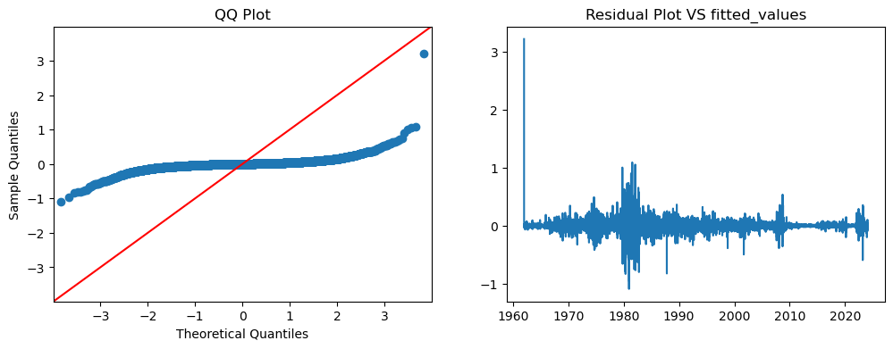

```python
import pandas as pd
import numpy as np
import math
import matplotlib.pyplot as plt 
```


```python
zeroCouponCurve_1yearMaturity = pd.read_csv(r"C:\Users\catri\OneDrive\文档\examarbete\dataset\DGS1-interestRate_1yearMaturity.csv", parse_dates=['DATE'], index_col=['DATE'])
zeroCouponCurve_1yearMaturity.head()
```


<div>
<style scoped>
    .dataframe tbody tr th:only-of-type {
        vertical-align: middle;
    }

    .dataframe tbody tr th {
        vertical-align: top;
    }

    .dataframe thead th {
        text-align: right;
    }
</style>
<table border="1" class="dataframe">
  <thead>
    <tr style="text-align: right;">
      <th></th>
      <th>DGS1</th>
    </tr>
    <tr>
      <th>DATE</th>
      <th></th>
    </tr>
  </thead>
  <tbody>
    <tr>
      <th>1962-01-02</th>
      <td>3.22</td>
    </tr>
    <tr>
      <th>1962-01-03</th>
      <td>3.24</td>
    </tr>
    <tr>
      <th>1962-01-04</th>
      <td>3.24</td>
    </tr>
    <tr>
      <th>1962-01-05</th>
      <td>3.26</td>
    </tr>
    <tr>
      <th>1962-01-08</th>
      <td>3.31</td>
    </tr>
  </tbody>
</table>
</div>


AR model 就是不能很好的模拟利息的变化，所以现实中不会用这个模型。


```python
#data preparation
zeroCouponCurve_1yearMaturity = zeroCouponCurve_1yearMaturity.replace(".", np.nan)

# Forward fill NaN values in the DataFrame
zeroCouponCurve_1yearMaturity = zeroCouponCurve_1yearMaturity.fillna(method='ffill')
zeroCouponCurve_1yearMaturity['DGS1'] = pd.to_numeric(zeroCouponCurve_1yearMaturity['DGS1'])

#我选1986是因为它好像是一个周期的起点，也是最低点。
zeroCouponCurve_1yearMaturity_f1986 =  zeroCouponCurve_1yearMaturity['1986-01-01':]# Select data from 1986 to today

zeroCouponCurve_1yearMaturity_f1986 = zeroCouponCurve_1yearMaturity #所以这里用的数据是整个series

#on effect 
zeroCouponCurve_1yearMaturity_f1986_log = np.log(zeroCouponCurve_1yearMaturity_f1986)
zeroCouponCurve_1yearMaturity_f1986_log.head()
```


<div>
<style scoped>
    .dataframe tbody tr th:only-of-type {
        vertical-align: middle;
    }

    .dataframe tbody tr th {
        vertical-align: top;
    }

    .dataframe thead th {
        text-align: right;
    }
</style>
<table border="1" class="dataframe">
  <thead>
    <tr style="text-align: right;">
      <th></th>
      <th>DGS1</th>
    </tr>
    <tr>
      <th>DATE</th>
      <th></th>
    </tr>
  </thead>
  <tbody>
    <tr>
      <th>1962-01-02</th>
      <td>1.169381</td>
    </tr>
    <tr>
      <th>1962-01-03</th>
      <td>1.175573</td>
    </tr>
    <tr>
      <th>1962-01-04</th>
      <td>1.175573</td>
    </tr>
    <tr>
      <th>1962-01-05</th>
      <td>1.181727</td>
    </tr>
    <tr>
      <th>1962-01-08</th>
      <td>1.196948</td>
    </tr>
  </tbody>
</table>
</div>


### How to test for stationarity?
The stationarity of a series can be established by looking at the plot of the series like we did earlier.

Another method is to split the series into 2 or more contiguous parts and computing the summary statistics like the mean, variance and the autocorrelation. If the stats are quite different, then the series is not likely to be stationary.

Nevertheless, you need a method to quantitatively determine if a given series is stationary or not. This can be done using statistical tests called ‘Unit Root Tests’. There are multiple variations of this, where the tests check if a time series is non-stationary and possess a unit root.

There are multiple implementations of Unit Root tests like:

Augmented Dickey Fuller test (ADH Test)  
Kwiatkowski-Phillips-Schmidt-Shin – KPSS test (trend stationary)  
Philips Perron test (PP Test)  
The most commonly used is the ADF test, where the null hypothesis is the time series possesses a unit root and is non-stationary. So, id the P-Value in ADH test is less than the significance level (0.05), you reject the null hypothesis.

The KPSS test, on the other hand, is used to test for trend stationarity. The null hypothesis and the P-Value interpretation is just the opposite of ADH test. The below code implements these two tests using statsmodels package in python.


```python
from statsmodels.tsa.stattools import adfuller, kpss

# ADF Test: p-value: 0.394  不能拒绝0假设，所以时序是非稳定态的。
# unit Root test
result = adfuller(zeroCouponCurve_1yearMaturity_f1986.DGS1.values, autolag='AIC')
print(f'ADF Statistic: {result[0]}')
print(f'p-value: {result[1]}')
for key, value in result[4].items():
    print('Critial Values:')
    print(f'   {key}, {value}')

"""
Critical Values: The critical values represent the threshold beyond which you would reject the null hypothesis. 
critical values here for different confidence levels (1%, 5%, and 10%). If the ADF Statistic is more negative than these critical values,
you may reject the null hypothesis.

# Interpret the results
if result[1] <= 0.05:
    print("Reject the null hypothesis; the time series has no unit root (stationary).")
else:
    print("Fail to reject the null hypothesis; the time series has a unit root (non-stationary).")
"""


# KPSS Test。 警告： The warning is informing you that the p-value is smaller than the smallest available in the lookup table. 
# 意思是no trend
result = kpss(zeroCouponCurve_1yearMaturity.DGS1.values, regression='c')
print('\nKPSS Statistic: %f' % result[0])
print('p-value: %f' % result[1])
for key, value in result[3].items():
    print('Critial Values:')
    print(f'   {key}, {value}')
    
```

    ADF Statistic: -2.156230981469304
    p-value: 0.2225126483176217
    Critial Values:
       1%, -3.4307547991108978
    Critial Values:
       5%, -2.8617189046361937
    Critial Values:
       10%, -2.5668652264564296
    
    KPSS Statistic: 9.988015
    p-value: 0.010000
    Critial Values:
       10%, 0.347
    Critial Values:
       5%, 0.463
    Critial Values:
       2.5%, 0.574
    Critial Values:
       1%, 0.739
    

    C:\Users\catri\anaconda3\Lib\site-packages\statsmodels\tsa\stattools.py:2018: InterpolationWarning: The test statistic is outside of the range of p-values available in the
    look-up table. The actual p-value is smaller than the p-value returned.
    
      warnings.warn(
    

### Cyclic and seasonal time series  
https://robjhyndman.com/hyndsight/cyclicts/  

https://www.youtube.com/watch?v=7UPgcI0ebi4

https://www.analyticsvidhya.com/blog/2023/02/various-techniques-to-detect-and-isolate-time-series-components-using-python/#Detecting_Cyclical_Variation

https://www.pythonforfinance.net/2019/07/22/time-series-decomposition-prediction-in-python/

#### Definitions  
A seasonal pattern exists when a series is influenced by seasonal factors (e.g., the quarter of the year, the month, or day of the week). Seasonality is always of a fixed and known period. Hence, seasonal time series are sometimes called periodic time series.  

A cyclic pattern exists when data exhibit rises and falls that are not of fixed period. The duration of these fluctuations is usually of at least 2 years. Think of business cycles which usually last several years, but where the length of the current cycle is unknown beforehand.  

Many people confuse cyclic behaviour with seasonal behaviour, but they are really quite different. If the fluctuations are not of fixed period then they are cyclic; if the period is unchanging and associated with some aspect of the calendar, then the pattern is seasonal. In general, the average length of cycles is longer than the length of a seasonal pattern, and the magnitude of cycles tends to be more variable than the magnitude of seasonal patterns.  

#### Cyclic and seasonal time series models  
ETS models  
Cyclic ARMA models (handle both seasonality and cyclic behaviour)
seasonal ARMA models

一般cycle都会在一个比较长的时间周期才能看到。

### ARIMA model
https://www.machinelearningplus.com/time-series/arima-model-time-series-forecasting-python/  

https://github.com/YohanCaillau/Time-Series/blob/master/arima_model.ipynb  

这里的ACF解释的是说现在的值只与1970年的数据有关？？！！这个ACF怎么理解呢  
difference order我选1，因为从数据本身看，是基本平稳了。但是ACF我不懂。
这里我没有去掉cycle，所以还去除之后才能分析。


```python
zeroCouponCurve_1yearMaturity.head()
```


<div>
<style scoped>
    .dataframe tbody tr th:only-of-type {
        vertical-align: middle;
    }

    .dataframe tbody tr th {
        vertical-align: top;
    }

    .dataframe thead th {
        text-align: right;
    }
</style>
<table border="1" class="dataframe">
  <thead>
    <tr style="text-align: right;">
      <th></th>
      <th>DGS1</th>
    </tr>
    <tr>
      <th>DATE</th>
      <th></th>
    </tr>
  </thead>
  <tbody>
    <tr>
      <th>1962-01-02</th>
      <td>3.22</td>
    </tr>
    <tr>
      <th>1962-01-03</th>
      <td>3.24</td>
    </tr>
    <tr>
      <th>1962-01-04</th>
      <td>3.24</td>
    </tr>
    <tr>
      <th>1962-01-05</th>
      <td>3.26</td>
    </tr>
    <tr>
      <th>1962-01-08</th>
      <td>3.31</td>
    </tr>
  </tbody>
</table>
</div>


unit root non stationay: 
方法一:从下面的数据( the sample autocorrelation function (ACF) plot for the observed time series. )可以看出，ACF为1，也就是几乎在一条直线上。 
也是说这个隐藏的随机变量的 charatteristic function 的解为一。 书上说的方法是differencing, page 76 Tsay

方法二: 书上是 [-0.5 , 0.5]  long memory model
Hurst Exponent < 0.5: Indicates anti-persistent behavior, where the time series tends to revert to its mean.

Hurst Exponent = 0.5: Implies a random walk or a series with no autocorrelation, indicating a lack of long-term memory.

Hurst Exponent > 0.5: Suggests persistent behavior, where past values have a lasting impact on future values. A higher Hurst exponent indicates stronger persistence.

In this case, a Hurst exponent of 0.6 falls in the range of persistent behavior, but it's not extremely high. It suggests that there is some degree of autocorrelation or memory in the time series, but not a very strong one.


```python
import numpy as np, pandas as pd
from statsmodels.graphics.tsaplots import plot_acf, plot_pacf
import matplotlib.pyplot as plt
from numpy import cumsum, log, polyfit, sqrt, std, subtract

#the presence of a unit root leads to slow decay in the ACF, but the ACF(1) doesn't have to be exactly 1. 
#It signifies positive correlation between consecutive observations


# Create a single figure with subplots for ACF and PACF
fig, axes = plt.subplots(1, 2, figsize=(10, 4))

# Plot ACF and PACF on the first subplot
plot_acf(zeroCouponCurve_1yearMaturity, lags=30, ax=axes[0])
axes[0].set_title('Original Series ACF')

plot_pacf(zeroCouponCurve_1yearMaturity, lags=30, ax=axes[1])
axes[1].set_title('Original Series PACF')


# Adjust layout and show the plot
plt.tight_layout()
plt.show()

```

    C:\Users\catri\anaconda3\Lib\site-packages\statsmodels\graphics\tsaplots.py:348: FutureWarning: The default method 'yw' can produce PACF values outside of the [-1,1] interval. After 0.13, the default will change tounadjusted Yule-Walker ('ywm'). You can use this method now by setting method='ywm'.
      warnings.warn(
    


    

    


```python
# How to find the order of differencing (d) in ARIMA model
# 1st Differencing
differenced_series = zeroCouponCurve_1yearMaturity.DGS1.diff().dropna()

# 1st Differencing
fig, axes = plt.subplots(1, 2, figsize=(10, 4))
plot_acf(differenced_series, lags=30, ax=axes[0])
axes[0].set_title('differenced Series ACF')
plot_pacf(differenced_series , lags=30, ax=axes[1])
axes[1].set_title('differenced Series PACF')
plt.tight_layout()
plt.show()

#check stationary, it is stationary. 
result = adfuller(differenced_series, autolag='AIC')
print(f'ADF Statistic: {result[0]}')
print(f'p-value: {result[1]}')
for key, value in result[4].items():
    print('Critial Values:')
    print(f'   {key}, {value}')
```


    

    


    ADF Statistic: -20.22783276398651
    p-value: 0.0
    Critial Values:
       1%, -3.4307547991108978
    Critial Values:
       5%, -2.8617189046361937
    Critial Values:
       10%, -2.5668652264564296
    


```python
#long memoery model先过吧
# Calculate the Hurst exponent manually
"""
lag_values = range(2, 20)
tau = [std(subtract(zeroCouponCurve_1yearMaturity[lag:], zeroCouponCurve_1yearMaturity[:-lag])) for lag in lag_values]
H = polyfit(log(lag_values), log(tau), 1)[0]

# Print the result 
print("Hurst Exponent:", H) #Hurst Exponent: [0.59655836]
"""
```


    '\nlag_values = range(2, 20)\ntau = [std(subtract(zeroCouponCurve_1yearMaturity[lag:], zeroCouponCurve_1yearMaturity[:-lag])) for lag in lag_values]\nH = polyfit(log(lag_values), log(tau), 1)[0]\n\n# Print the result \nprint("Hurst Exponent:", H) #Hurst Exponent: [0.59655836]\n'


Series is stationary after 1 differencing, and from its ACF and PACF plot, we can see order for AR and MA IS 1. SO The order for ARIMA model is (1,1,1). the order of MA, choose lags which has significant ACF. The order of AR uses PACF. 


```python
# differenced_series stational
result = adfuller(differenced_series.values, autolag='AIC')
print(f'ADF Statistic: {result[0]}')
print(f'p-value: {result[1]}')
for key, value in result[4].items():
    print('Critial Values:')
    print(f'   {key}, {value}')
```

    ADF Statistic: -20.22783276398651
    p-value: 0.0
    Critial Values:
       1%, -3.4307547991108978
    Critial Values:
       5%, -2.8617189046361937
    Critial Values:
       10%, -2.5668652264564296
    


```python
# ARMA example
from statsmodels.tsa.arima.model import ARIMA

#p order of AR, q order of MA
# fit model
model = ARIMA(zeroCouponCurve_1yearMaturity_f1986, order=(1, 1, 1))
model_fit = model.fit()
# make prediction
#yhat = model_fit.predict(len(zeroCouponCurve_1yearMaturity_f1986), len(zeroCouponCurve_1yearMaturity_f1986))
print(model_fit.summary())
```

    C:\Users\catri\anaconda3\Lib\site-packages\statsmodels\tsa\base\tsa_model.py:471: ValueWarning: No frequency information was provided, so inferred frequency B will be used.
      self._init_dates(dates, freq)
    C:\Users\catri\anaconda3\Lib\site-packages\statsmodels\tsa\base\tsa_model.py:471: ValueWarning: No frequency information was provided, so inferred frequency B will be used.
      self._init_dates(dates, freq)
    C:\Users\catri\anaconda3\Lib\site-packages\statsmodels\tsa\base\tsa_model.py:471: ValueWarning: No frequency information was provided, so inferred frequency B will be used.
      self._init_dates(dates, freq)
    

                                   SARIMAX Results                                
    ==============================================================================
    Dep. Variable:                   DGS1   No. Observations:                16194
    Model:                 ARIMA(1, 1, 1)   Log Likelihood               18415.212
    Date:                Wed, 14 Feb 2024   AIC                         -36824.423
    Time:                        10:25:23   BIC                         -36801.346
    Sample:                    01-02-1962   HQIC                        -36816.795
                             - 01-26-2024                                         
    Covariance Type:                  opg                                         
    ==============================================================================
                     coef    std err          z      P>|z|      [0.025      0.975]
    ------------------------------------------------------------------------------
    ar.L1          0.9195      0.005    192.598      0.000       0.910       0.929
    ma.L1         -0.8748      0.006   -147.372      0.000      -0.886      -0.863
    sigma2         0.0060   1.71e-05    351.499      0.000       0.006       0.006
    ===================================================================================
    Ljung-Box (L1) (Q):                  29.91   Jarque-Bera (JB):            563469.16
    Prob(Q):                              0.00   Prob(JB):                         0.00
    Heteroskedasticity (H):               0.12   Skew:                            -0.14
    Prob(H) (two-sided):                  0.00   Kurtosis:                        31.90
    ===================================================================================
    
    Warnings:
    [1] Covariance matrix calculated using the outer product of gradients (complex-step).
    

The interest rate data exhibits cyclic patterns, characterized by repeated rises and falls without a fixed duration. However, ARIMA models, designed to capture linear trends and stationary patterns, may not be well-suited for modeling such non-linear complexities. To achieve a higher goodness-of-fit model, we need to explore more advanced time series models capable of accommodating non-linear patterns.


```python
residuals = model_fit.resid #pandas series
fitted_values = zeroCouponCurve_1yearMaturity_f1986 - residuals # fitted_values should also be a series

```


```python
"""
plt.scatter(fitted_values, residuals)  #就是卡在这了，怎么都不行，一直看不到图
plt.xlabel('Series 1')
plt.ylabel('Series 2')
plt.title('Scatter Plot')
plt.show()
"""
```


    "\nplt.scatter(fitted_values, residuals)  #就是卡在这了，怎么都不行，一直看不到图\nplt.xlabel('Series 1')\nplt.ylabel('Series 2')\nplt.title('Scatter Plot')\nplt.show()\n"


```python

```


```python
import statsmodels.api as sm
import matplotlib.pyplot as plt


fig, ax = plt.subplots(1, 2, figsize=(12, 4))  # Adjusted figure size for clarity

# QQ Plot  
sm.qqplot(residuals, line='45', ax=ax[0])
ax[0].set_title('QQ Plot')

# Residual Plot
ax[1].plot(residuals)
ax[1].set_title('Residual Plot VS fitted_values')

plt.show()
```


    

    


```python
#预测出来的效果非常差，因为没有考虑周期。
# Make predictions
forecast_steps = 180  # Number of steps to forecast
forecast = model_fit.get_forecast(steps=forecast_steps)

# Plot the original data and predictions
plt.figure(figsize=(10, 5))
plt.plot(zeroCouponCurve_1yearMaturity_f1986, label='Original Data', marker='o')
plt.plot(forecast.predicted_mean, label='Predicted Values', color='red', linestyle='--', marker='o')

# Plot confidence intervals
ci = forecast.conf_int()
plt.fill_between(ci.index, ci.iloc[:, 0], ci.iloc[:, 1], color='pink', alpha=0.3, label='95% Confidence Interval')

plt.title('ARIMA Model Forecast')
plt.xlabel('Time')
plt.ylabel('Value')
plt.legend()
plt.show()
```


    

    


```python

```
